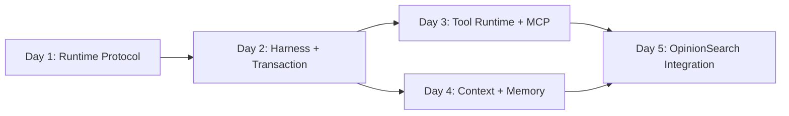

# OpinionSearch Agent 5 天高强度实施计划

> 计划状态：当前执行计划  
> 计划周期：连续 5 个高强度开发日  
> 最后更新：2026-08-20  
> Canonical：[OpinionSearch Agent 项目设计](./public-opinion-search-agent-design.md)

除非明确说明，本计划中的命令从 `opinion_search_agent/` 执行。

## 1. 五天目标

五天内完成一个由 OpinionSearch workload 验证的单 Agent Harness，深做两层：

```text
① Agent Harness / Runtime
   lifecycle + loop + protocols + reducer
   + step transaction + checkpoint/resume
   + recovery + completion control

② Capability Runtime
   tool registry/executor + adapters + MCP
   + context compiler + run-scoped working memory
```

第五天必须能够现场演示：

1. fake model/search/reader 驱动完整离线舆情调查；
2. Runtime 每步按明确 lifecycle 推进；
3. Tool Executor 处理 schema、timeout、retry 和 typed error；
4. Context Compiler 在固定窗口内保留目标、关键 Gap、矛盾和最近失败；
5. Working Memory 从 State 重建，不成为第二事实源；
6. 三种中断窗口恢复后不重复已提交的 State effect；
7. 一个 MCP tool 通过 adapter 被统一调用；
8. 真实搜索和阅读 adapter 完成一条公开 Web 舆情调查。

## 2. 不进入五天计划的内容

- Environment/Sandbox 平台；
- 分布式队列、worker 和 Control Plane；
- Trace/Data/Observability 平台；
- Eval、Benchmark、Feedback 或 Dataset 平台；
- Model Serving、Training、Fine-tuning 和 RL；
- Web UI、HTTP API、多 Agent、subagent；
- 跨会话长期记忆、向量数据库；
- MCP gateway、marketplace 或 server fleet；
- 完整舆情平台、社交平台采集和传播指标。

开发日志、StepRecord、Checkpoint 和 deterministic tests 只服务 Runtime 正确性，不扩展成其他 Infra 层。

## 3. 协作方式

### 用户负责核心语义

- lifecycle、protocol 和 transaction boundary；
- Agent Loop 与 Reducer；
- Tool Registry/Executor 核心控制逻辑；
- Context selection、priority 和 compaction policy；
- Working Memory projector/update policy；
- Completion Control 与 OpinionSearch domain rule。

### 导师直接承担机械工作

- fake model/search/reader/MCP transport；
- Brave Search、Jina Reader、OpenAI-compatible、MCP adapter；
- HTTP retry/cache/URL normalize 辅助；
- checkpoint JSON 原子文件操作；
- fixtures、同构测试、contract tests 和故障注入外壳；
- CLI glue、README 和回归测试。

每个检查点先讲清用途、整体逻辑、输入输出、设计取舍、失败模式和验收，再由用户写核心。用户冻结接口后，导师直接补机械实现和测试。

## 4. 每日节奏与闸门

| 时间段 | 活动 | 结果 |
|---|---|---|
| 09:00–10:00 | 讲解、回归、冻结当日边界 | 当日 protocol 和不变量 |
| 10:00–13:00 | 用户核心实现；导师准备 fake/fixture/tests | 第一纵向切片 |
| 14:00–16:30 | 实现与集成 | 可运行模块 |
| 16:30–18:30 | review、故障注入、修改 | P0 测试通过 |
| 20:00–21:30 | 端到端回归与设计复述 | 验收证据 |

当天 P0 闸门没有通过，不进入下一天核心模块。每天都要运行纵向切片，不能到第五天才首次集成。

## 5. P0 与砍项顺序

### P0 必须完成

- Run/Step lifecycle；
- Decision/Action/Observation/Delta 边界；
- deterministic Reducer 和 Agent Loop；
- step transaction、checkpoint/resume；
- Tool Registry/Executor、typed error、timeout/retry；
- fake 与真实 search/reader adapter；
- 一个最小 MCP adapter；
- Context Compiler 的分层、选择、压缩和 overflow fallback；
- run-scoped Working Memory；
- OpinionSearch CompletionPolicy；
- offline E2E 和真实 Web smoke。

### P1 有余力才做

- URL response cache；
- query 近似去重；
- 更细的 tokenizer adapter；
- 多个 MCP tool；
- 第二个真实案例；
- CLI 展示优化。

### 进度落后时

先砍 P1，再减少真实 provider 和 demo 数量。不能砍 transaction/recovery、Tool Executor、Context Compiler、Working Memory 或离线 E2E，因为它们就是本项目的主题。

## 6. Day 1：Runtime Protocol 与 Lifecycle

### 6.1 当日要解决什么

建立 Harness 的控制语言：一次 run 和一个 step 处于什么状态，Model Decision、Runtime Action、Tool/内部 Observation 和 StateDelta 如何衔接。

第一天不追求工具和舆情对象丰富度。目标是让后续模块不通过任意 dict 猜测彼此语义。

### 6.2 整体逻辑

```text
RunState
  -> Step opened
  -> DecisionEnvelope
  -> validated ActionRequest
  -> ObservationEnvelope
  -> StateDelta
  -> committed RunState
```

Decision 是模型提案；ActionRequest 是 Runtime 已接受的执行命令；Observation 是 action 结果；StateDelta 是 domain processor 提议的状态变化。四者不能合并。

### 6.3 用户亲手实现

1. `RunStatus` 与合法 run transition；
2. `StepPhase` 与合法 step transition；
3. `DecisionEnvelope`、`ActionRequest`、`ObservationEnvelope`、`StepRecord` 的职责和最小字段；
4. Runtime error taxonomy；
5. OpinionSearch 四种 Decision 的 domain payload；
6. State ownership 说明：Runtime State、Domain State、Working Memory、Checkpoint 的边界。

### 6.4 导师实现

1. 枚举、模型 round-trip 和非法 transition 的重复性测试；
2. fixture ID、Clock 和 deterministic ID 辅助；
3. 清理旧 `budget_profile/output_mode` 测试；
4. 删除旧 `search_web/read_url` 测试假设；
5. 准备 Day 2 的 scripted decisions。

### 6.5 文件

用户创建或修改：

- `opinion_search_agent/src/opinion_search/runtime/lifecycle.py`
- `opinion_search_agent/src/opinion_search/runtime/protocols.py`
- `opinion_search_agent/src/opinion_search/domain/opinion/decisions.py`
- `opinion_search_agent/src/opinion_search/app/contracts.py`

导师创建或修改：

- 必要的 package `__init__.py`；
- `opinion_search_agent/tests/unit/runtime/test_lifecycle.py`
- `opinion_search_agent/tests/unit/runtime/test_protocols.py`
- `opinion_search_agent/tests/unit/domain/opinion/test_decisions.py`
- `opinion_search_agent/tests/unit/app/test_search_request.py`
- `opinion_search_agent/tests/fixtures/scripted_decisions.json`

### 6.6 用户必须思考

- run status 和 step phase 为什么不能放进同一个枚举？
- Decision 何时变成 ActionRequest？
- `step_id` 与 `attempt` 的关系是什么？
- malformed model output 是否已经构成 Decision？
- 哪些错误属于本 attempt retry，哪些应反馈下一轮 Agent？
- Runtime envelope 应携带哪些关联信息，哪些领域字段绝不能进入它？
- StepRecord 为什么是恢复对象而不是 Observability trace？

### 6.7 最小测试

- 合法 lifecycle transition 通过；
- 终态不能重新进入 running；
- committed step 不可倒退；
- 四种 domain decision 可判别解析；
- action-specific extra fields 被拒绝；
- envelope JSON round-trip；
- provider 字段不进入 Runtime/domain decision；
- `SearchRequest` 不再包含 budget/output mode。

### 6.8 Day 1 验收闸门

- lifecycle 和 protocol tests 全部通过；
- 可以画出 Decision → Action → Observation → Delta → State；
- 可以解释 run/step 两套状态机；
- 没有 Tool、Context 或舆情 Evidence 的提前实现；
- 当前协议足以驱动 Day 2 fake loop。

### 6.9 发给导师 review

- 用户负责文件的 diff；
- lifecycle transition 表；
- 七个设计问题的答案；
- 定向 pytest 输出。

## 7. Day 2：Deterministic Harness、Reducer 与恢复骨架

### 7.1 当日要解决什么

把 Day 1 protocol 变成可运行的 Agent Harness，并建立唯一 State 写入口、step transaction 和最小 checkpoint/resume。

### 7.2 整体逻辑

```text
initialize/load
-> build minimal context
-> fake model decision
-> validate
-> fake/internal action
-> observation
-> domain processor
-> reducer
-> atomic commit
-> continue/finish
```

### 7.3 用户亲手实现

1. `OpinionSearchState` 的最小领域状态；
2. pure Reducer 与不变量；
3. async Agent Loop 的固定时序；
4. step transaction 的 pending/observed/committed 语义；
5. Completion Control 调用协议；
6. resume 决策规则。

### 7.4 导师实现

1. FakeModelClient；
2. 最小 fake action handler；
3. 版本化 JSON checkpoint 原子文件操作；
4. crash injection fixture；
5. Reducer、Loop、checkpoint 的机械测试。

### 7.5 文件

用户创建或修改：

- `opinion_search_agent/src/opinion_search/domain/opinion/state.py`
- `opinion_search_agent/src/opinion_search/domain/opinion/reducer.py`
- `opinion_search_agent/src/opinion_search/runtime/loop.py`
- `opinion_search_agent/src/opinion_search/runtime/transaction.py`
- `opinion_search_agent/src/opinion_search/runtime/completion.py`

导师创建或修改：

- `opinion_search_agent/src/opinion_search/models/contracts.py`
- `opinion_search_agent/src/opinion_search/models/fake.py`
- `opinion_search_agent/src/opinion_search/runtime/checkpoint.py`
- `opinion_search_agent/tests/unit/domain/opinion/test_reducer.py`
- `opinion_search_agent/tests/unit/runtime/test_transaction.py`
- `opinion_search_agent/tests/integration/test_offline_loop.py`
- `opinion_search_agent/tests/integration/test_checkpoint_resume.py`

### 7.6 用户必须思考

- Loop 为什么不能直接修改 domain state？
- 同一个 delta 被应用两次时怎么办？
- action 已返回但 State 未提交时 resume 做什么？
- State 已提交但 step completion 未返回时怎么办？
- 外部 search 请求能否真正 exactly-once？
- finish rejection 如何进入下一轮，而不伪造成工具证据？
- cancellation 和 safety stop 返回怎样的 RunResult？

### 7.7 最小测试

- Reducer 确定性、不可变和幂等；
- fake loop 至少完成四个 step；
- premature finish 被拒绝后继续；
- action 前 crash 可以安全重启；
- observation 后/commit 前 crash 行为明确；
- commit 后 crash 不重复 State effect；
- cancellation 返回已提交 partial state。

### 7.8 Day 2 验收闸门

- 无联网和 API key 可跑完整 Loop；
- 三个崩溃窗口都有测试；
- 所有 State 变化只经过 Reducer；
- checkpoint 可以在新进程语义下恢复；
- 用户能解释 effectively-once state effect。

### 7.9 发给导师 review

- 核心 diff；
- Reducer invariants；
- 三个 crash scenario 输出；
- 一份 checkpoint 样例；
- 一次 normal 和一次 partial run 结果。

## 8. Day 3：Tool Runtime 与 MCP Adapter

> 状态：已完成（2026-08-19）。离线全量验收为 `305 passed, 1 skipped`；唯一 skip 是必须显式开启并提供凭据的真实 provider smoke。

### 8.1 当日要解决什么

把“调用工具”从 Loop 中抽出成为完整 capability runtime。Agent Loop 不知道 Brave、Jina 或 MCP transport，只认识统一 ActionRequest/Observation。

### 8.2 整体逻辑

```text
ActionRequest
-> ToolRegistry.resolve
-> argument validation
-> ToolExecutor
-> timeout/retry/cancel
-> ToolAdapter
-> normalize ToolResult/ToolError
-> ObservationEnvelope
```

### 8.3 用户亲手实现

1. ToolDefinition/ToolCall/ToolResult/ToolError；
2. ToolRegistry 的注册、解析、重名和 schema export；
3. ToolExecutor 的控制流程；
4. retry policy 和 error decision table；
5. ActionRequest 到 ToolCall 的 resolver；
6. Tool output 的 untrusted boundary。

### 8.4 导师实现

1. FakeSearch/FakeReader adapter；
2. Brave Search/Jina Reader adapter；
3. HTTP timeout、backoff、URL normalize 和 cache 辅助；
4. fake MCP transport 与 MCP adapter；
5. provider contract tests 和错误 fixtures。

### 8.5 文件

用户创建或修改：

- `opinion_search_agent/src/opinion_search/tools/contracts.py`
- `opinion_search_agent/src/opinion_search/tools/registry.py`
- `opinion_search_agent/src/opinion_search/tools/executor.py`
- `opinion_search_agent/src/opinion_search/domain/opinion/action_resolver.py`

导师创建或修改：

- `opinion_search_agent/src/opinion_search/tools/adapters/fake.py`
- `opinion_search_agent/src/opinion_search/tools/adapters/serper.py`
- `opinion_search_agent/src/opinion_search/tools/adapters/jina_reader.py`
- `opinion_search_agent/src/opinion_search/tools/adapters/mcp.py`
- `opinion_search_agent/tests/unit/tools/test_registry.py`
- `opinion_search_agent/tests/unit/tools/test_executor.py`
- `opinion_search_agent/tests/contract/test_tool_adapters.py`
- `opinion_search_agent/tests/contract/test_mcp_adapter.py`
- `opinion_search_agent/tests/integration/test_loop_with_tools.py`

### 8.6 用户必须思考

- Decision 与 ToolCall 为什么不同？
- Registry 应向模型暴露哪些 schema，隐藏哪些 metadata？
- retry 为什么由 Executor 而不是 Agent 决定？
- 同一 action 的 retry 如何保持 identity？
- ToolError 哪些字段可以安全反馈模型？
- MCP schema 与内部 schema 不兼容时在哪里失败？
- 网页中的工具调用指令为什么不能被执行？

### 8.7 最小测试

- duplicate registration 和 unknown tool；
- schema validation 在 adapter 前发生；
- timeout、429、5xx 有正确 retry 次数；
- auth/invalid args 不重试；
- cancellation 打断 retry；
- fake/live adapter 满足相同 contract；
- MCP discover/schema/call/error 正规化；
- raw provider object 不进入 State。

### 8.8 Day 3 验收闸门

- 替换 FakeSearch 与 Brave Search 不修改 Loop；
- 替换 FakeReader 与 Jina 不修改 Loop；
- 一个 MCP tool 通过内部 Registry/Executor 调用；
- 每种 ToolError 有确定语义；
- tool output 不具有指令权限。

### 8.9 发给导师 review

- Registry/Executor 核心 diff；
- retry/error decision table；
- fake 与 MCP contract tests；
- 一次 live search/read smoke，或凭据缺失说明。

## 9. Day 4：Context Compiler 与 Working Memory

> 状态：已完成（2026-08-20）。全量离线验收为 `332 passed, 1 skipped`；7-step 长轨迹保持固定 context budget，checkpoint resume 可确定性重建完全相同的 CompiledContext。

### 9.1 当日要解决什么

让长程 Agent 不依赖无限增长的 messages list。完整 State 保持权威，Memory 形成紧凑认知视图，Compiler 按本轮决策需要生成模型上下文。

### 9.2 整体逻辑

```text
Full State
-> deterministic memory projection
-> collect L0/L1/L2/L3 sections
-> relevance selection
-> priority allocation
-> deduplication
-> compaction
-> render + measure
-> overflow fallback
-> CompiledContext
```

### 9.3 用户亲手实现

1. ContextSection、priority 和 provenance；
2. ContextCompiler pipeline；
3. 当前 Gap 驱动的 selector；
4. deterministic compaction/fallback 顺序；
5. WorkingMemory model 与 projector；
6. memory refresh trigger；
7. prompt injection boundary。

### 9.4 导师实现

1. TokenEstimator fake 和一个实际 tokenizer adapter（若必要）；
2. 长正文、重复 observation、矛盾证据和 malicious page fixtures；
3. context snapshot tests；
4. memory property-style repetitive cases；
5. overflow 故障注入。

### 9.5 文件

用户创建或修改：

- `opinion_search_agent/src/opinion_search/context/models.py`
- `opinion_search_agent/src/opinion_search/context/compiler.py`
- `opinion_search_agent/src/opinion_search/context/selector.py`
- `opinion_search_agent/src/opinion_search/context/compactor.py`
- `opinion_search_agent/src/opinion_search/memory/models.py`
- `opinion_search_agent/src/opinion_search/memory/projector.py`

导师创建或修改：

- `opinion_search_agent/tests/fixtures/context/long_run.json`
- `opinion_search_agent/tests/fixtures/context/prompt_injection_page.json`
- `opinion_search_agent/tests/unit/context/test_compiler.py`
- `opinion_search_agent/tests/unit/context/test_selector.py`
- `opinion_search_agent/tests/unit/context/test_compactor.py`
- `opinion_search_agent/tests/unit/memory/test_projector.py`
- `opinion_search_agent/tests/integration/test_loop_context_growth.py`

### 9.6 用户必须思考

- Full State、Working Memory 和 Context 为什么不是同一个对象？
- 哪些 section 永远不能被压缩掉？
- current Gap 如何影响 Evidence/Candidate 选择？
- contradiction 和 failed direction 为什么比普通旧 observation 重要？
- summary 如何证明没有创造新事实？
- context 超限时按什么顺序降级？
- checkpoint resume 后 Memory 应恢复还是重新投影？

### 9.7 最小测试

- L0/L1 始终保留；
- 为输出预留 headroom；
- 相关 Evidence 优先于无关网页内容；
- 重复 observation 去重；
- contradiction/failed direction/finish rejection 不丢失；
- malicious content 只在 untrusted section；
- memory 每个事实能映射回 State；
- resume 后 context 结果确定。

### 9.8 Day 4 验收闸门

- 固定 budget 下完成一条长轨迹；
- context 不随 step 线性无限增长；
- compaction 后仍能正确选择下一 action；
- Working Memory 可删除并从 State 重建；
- 用户能解释 lost-in-the-middle 和 injection 防护策略。

### 9.9 发给导师 review

- Compiler/Memory 核心 diff；
- 一份 section allocation 样例；
- compaction 前后对照；
- malicious fixture 渲染结果；
- context growth 测试输出。

## 10. Day 5：OpinionSearch 深度整合与 Recovery Matrix

> 完成状态：已完成并升级到 Opinion Context V1；Brave→Jina 与 `deepseek-v4-flash` live Agent 已真实贯通。系统已将来源 acquisition intent 与 Evidence semantic coverage 分离，显式构建事实基线、主体立场、dominant/emerging/counter narratives；最新 live run 在 14 个 committed steps 后完成全部四个舆情维度并正常 finish，当前策略重算仍为 complete；全量回归为 375 passed、2 个 gated smoke skipped，最终审查无残余 Critical/Important。

### 10.1 当日要解决什么

用真实 OpinionSearch domain 把两层完整串起来，系统化验证 model、tool、context、memory 和 transaction 失败，而不是新增第三层平台能力。

### 10.2 用户亲手实现

1. InvestigationGap、CandidateSource、Source、Evidence、Claim 的最小规则；
2. Observation processor 和 domain delta；
3. OpinionSearch CompletionPolicy；
4. 对 Loop、Tool、Context、Memory 的端到端 review；
5. 真实 demo 的行为分析和失败复盘。

### 10.3 导师实现

1. OpinionSearch fixtures 和机械 model tests；
2. OpenAI-compatible model adapter；
3. app service、CLI 和配置加载；
4. 全量 recovery matrix tests；
5. README、offline/live/resume 命令；
6. 全量回归与最终 diff review。

### 10.4 文件

用户创建或修改：

- `opinion_search_agent/src/opinion_search/domain/opinion/state.py`
- `opinion_search_agent/src/opinion_search/domain/opinion/processor.py`
- `opinion_search_agent/src/opinion_search/domain/opinion/completion.py`
- `opinion_search_agent/src/opinion_search/domain/opinion/reducer.py`

导师创建或修改：

- `opinion_search_agent/src/opinion_search/models/openai_compatible.py`
- `opinion_search_agent/src/opinion_search/domain/opinion/brief.py`
- `opinion_search_agent/src/opinion_search/app/service.py`
- `opinion_search_agent/src/opinion_search/__main__.py`
- `opinion_search_agent/README.md`
- `opinion_search_agent/tests/fixtures/opinion_case/`
- `opinion_search_agent/tests/e2e/test_offline_demo.py`
- `opinion_search_agent/tests/e2e/test_resume_demo.py`
- `opinion_search_agent/tests/e2e/test_recovery_matrix.py`
- `opinion_search_agent/tests/e2e/test_real_web_smoke.py`

### 10.5 Recovery Matrix

最终至少覆盖：

1. malformed model payload；
2. empty/refused model response；
3. invalid candidate ID；
4. duplicate query/URL；
5. tool timeout；
6. rate limit/server error；
7. unreadable page；
8. premature finish；
9. context overflow；
10. action 前 crash；
11. observation 后/commit 前 crash；
12. commit 后 crash；
13. cancellation；
14. hard safety stop。

### 10.6 真实 demo 标准

- 事件有清晰时间范围；
- 至少一个一手来源和两个不同叙事来源；
- 无需登录；
- 不涉及个人敏感信息推断；
- 10–20 steps 内可得到 complete 或 meaningful partial；
- 输出不宣称全网情绪比例。

### 10.7 Day 5 验收闸门

- `pytest` 全量通过；
- CLI 可运行 offline、live 和 resume；
- fake/real/MCP tool 都经过同一 Registry/Executor；
- Context Compiler 和 Working Memory 参与每轮 decision；
- recovery matrix 全部具有明确预期；
- 真实 brief 包含来源、争议、remaining gaps 和 stop reason；
- README 能让新读者从空环境运行 offline demo；
- 代码未导入 `archive/`，未引入第 ③–⑦ 层平台能力。

### 10.8 最终交付给导师 review

- `git diff -- opinion_search_agent docs CLAUDE.md`；
- 全量 pytest 输出；
- offline/live/resume 命令和结果；
- 一个 checkpoint 样例；
- Context allocation 样例；
- Recovery Matrix 结果；
- 5–10 分钟两层架构复述。

## 11. 依赖关系



Day 3 和 Day 4 在 Day 2 闸门通过后可以并行推进，但用户同一时间只承担一个核心模块。

## 12. 风险控制

| 风险 | 信号 | 当天处理 |
|---|---|---|
| Runtime 过度泛化 | 出现任意 JSON plugin framework | 只保留 OpinionSearch 的真实消费者 |
| Domain 反客为主 | 大量时间做 Claim taxonomy | 缩回最小 workload 规则 |
| Loop 变成巨型类 | 模型、工具、State、context 都在一处 | 按 protocol 拆出纯组件 |
| Checkpoint 假恢复 | 只保存 State，不记录 pending step | 加入 step transaction 故障注入 |
| Tool 只是函数包装 | 没有 registry/schema/retry/error contract | 以 Executor tests 为验收核心 |
| MCP 喧宾夺主 | 开始建设 server/gateway | 限制为单 adapter contract |
| Context 只是字符串拼接 | 无 section、priority、budget | 强制 ContextPlan/CompiledContext 边界 |
| Memory 成为第二事实源 | summary 无法回指 State | deterministic projector + provenance |
| 误做 Observability/Eval | 开始设计事件仓库或 judge | 删除，回到软件测试和 Runtime record |
| 第五天首次集成 | 各模块只跑单测 | 每天维护 offline vertical slice |

## 13. 每日收尾模板

```text
今日纵向闭环：
通过的 P0 闸门：
冻结的 protocol / invariant：
失败注入及实际行为：
仍未解决但不阻塞的问题：
明日第一个动作：
我能独立解释的 Infra 决策：
```

## 14. 五天后如何继续

五天后只在前两层内深化。优先根据 recovery matrix 和真实 workload 选择：更严格的 transaction/idempotency、更多 MCP compatibility、context selection 改进、memory refresh 策略或 tool concurrency。不要自然扩展到 Control Plane、Observability、Evaluation 或 Model Infra；如果以后要做，应作为独立项目立项。
