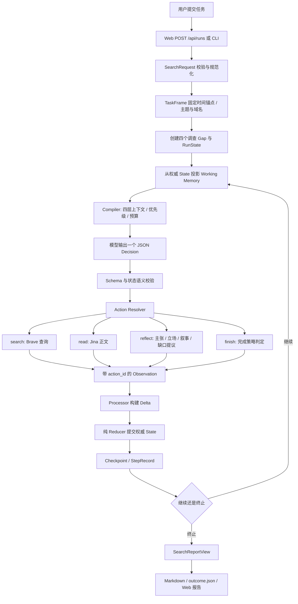

# OpinionSearch 搜索机制、RAG 判断与端到端技术链路

OpinionSearch 当前是一个由调查缺口驱动、调用外部搜索引擎与网页 Reader、维护结构化证据并输出舆情简报的单 Agent Harness。自研部分主要在调查过程控制、证据关系、上下文管理和恢复语义；网页索引与初始相关性排序由外部服务提供。

当前已经具备“检索外部信息，再据此生成”的广义检索增强行为，但没有自建文档检索索引、Embedding、BM25、向量搜索或学习式 Reranker。近期最有价值的提升是让任务约束真正影响检索、改进正文证据选择和最终结论验证；向量数据库不是当前完成一次公开 Web 调查的前提。

本文对应 2026-09-09 工作区代码。代码事实、离线执行事实、外部公开架构与演进建议分别说明；不把离线成功解释为真实任务质量、不把 `completed` 解释为事实正确。

**可直接打开的配套材料：**

- [本次实际输出的完整简报](/Users/mac/Desktop/resume_proj/agent_code/docs/search-analysis-artifacts/2026-09-09/report.md)
- [10 步完整决策、动作、观察与状态计数](/Users/mac/Desktop/resume_proj/agent_code/docs/search-analysis-artifacts/2026-09-09/steps.json)
- [第一次决策的完整模型输入](/Users/mac/Desktop/resume_proj/agent_code/docs/search-analysis-artifacts/2026-09-09/context-01.txt)
- [最后一次决策的完整模型输入](/Users/mac/Desktop/resume_proj/agent_code/docs/search-analysis-artifacts/2026-09-09/context-10.txt)
- [全部上下文预算与选择记录](/Users/mac/Desktop/resume_proj/agent_code/docs/search-analysis-artifacts/2026-09-09/contexts.json)
- [时间解析与段落评分的实测结果](/Users/mac/Desktop/resume_proj/agent_code/docs/search-analysis-artifacts/2026-09-09/probes.json)

## 1. 当前“搜索”实际上有三个不同层次

| 层次 | 解决的问题 | 当前实现 | 决定者 |
|---|---|---|---|
| 网页发现 | 哪些网页可能相关？ | Brave Web Search，默认每次最多 5 条候选 | 模型生成 query；Brave 召回与排序 |
| 页面内证据选择 | 一篇网页里哪几段值得保留？ | 正文切块、噪声过滤、关键词重合评分，最多 3 块 | 本地确定性规则 |
| 决策上下文选择 | 本轮模型应该看哪些已知信息？ | 按调查缺口、证据关联、优先级和预算选择/截断/删除 | Context Compiler |

这三个层次不能混称为同一种检索。接一个向量库主要改善第二、第三层，不能自动让 Brave 找到更多相关网页，也不能补上没有采集到的平台数据。[^c1]

默认 live 组合只有 `BraveSearchAdapter + JinaReaderAdapter + OpenAICompatibleModelClient`。仓库虽然有 Serper 与 MCP adapter，以及 provider fallback 的基础设施，但 `build_live_service()` 并没有注册 Serper 或 MCP，也没有默认多引擎并行聚合。配置了多个 provider 时的失败切换，与同时搜索多个引擎后融合排名，是两种能力。[^c2]

## 2. 与主流搜索的区别

Google 官方将基础搜索流程描述为抓取、索引、提供搜索结果。这个层级负责互联网内容发现和相关性排序；OpinionSearch 调用已有引擎，不承担全网索引。[^w1]

联网研究 Agent 则位于检索引擎之上：规划、搜索、阅读、调整方向、综合答案。Anthropic 公开的 Research 架构采用 Lead Researcher 调度并行子 Agent，并包含独立引用处理环节。该公开方案是可对照的代表，不意味着所有商业产品都采用相同内部实现。[^w2]

| 维度 | 传统网页搜索 | 联网研究 Agent 的代表性方案 | 知识库 RAG | 当前 OpinionSearch |
|---|---|---|---|---|
| 输入 | 查询词/问题 | 开放任务 | 问题 + 已有语料 | 问题 + 可选主题/时间/关注点/域名 |
| 数据底座 | 全网索引 | 外部搜索、网页、连接器 | 自建/托管文档索引 | Brave 索引 + 本次读到的页面 |
| 查询推进 | 单次查询为主要交互单位 | 自适应多轮；可并行 | 单轮或 Agent 驱动多轮 | 单 Agent 每轮一个决策 |
| 查询规划 | 引擎内部 query 理解 | 可按问题动态拆分方向 | 可重写查询、多路召回 | 固定四个 gap；模型逐轮写 query |
| 页面处理 | 引擎内部抓取与索引 | 搜索、Reader、浏览器等 | 入库解析、切块 | Jina + 本地规则切块 |
| 相关性排序 | 引擎拥有排序系统 | 组合检索与模型判断 | BM25/向量/混合/Rerank 等 | 网页沿用 Brave 排序，读哪篇由模型选；段落用规则评分 |
| 证据组织 | 通常以网页结果为单位 | 研究结果与引用 | chunk + 文档元数据 | Source/Evidence/Claim/Position/Narrative/Gap |
| 完成规则 | 返回结果 | 产品/Agent 策略 | 通常生成答案，也可设门槛 | 确定性 CompletionPolicy |
| 主要产出 | 相关网页/搜索结果页 | 综合研究答案 | 知识问答/业务答案 | 固定结构、附证据的舆情简报 |

RAG 也可以有 Agent、多轮搜索和工具调用，不能把它永久定义成“静态 Top-K”。原始 RAG 论文展示了生成模型与可检索外部记忆结合的做法；现代工程中常见全文与向量混合，Azure AI Search 官方方案用 BM25 与向量检索，再以 RRF 融合排名，语义重排可选。[^w3][^w4]

**当前工程优势：** 模型只提议，Runtime 检查并执行；网页摘要不能直接变成证据；事实、归因陈述与解释分开记录；支持与反驳关系可同时保存；有预算、终止与恢复边界。

**当前产品局限：** 搜索覆盖较薄、四维度模板较硬、证据相关性较粗、来源独立性与语义支持主要依赖模型，缺少实任务效果的对比证据。因此不能据此声称比商业研究产品更准确。

## 3. 从输入到报告的总链路



单轮只选一种动作。图中分支不表示并行执行，也不意味着每轮必须按 `search → read → reflect` 的固定次序运行。离线样例是预设这一顺序；live 顺序由模型在合法动作范围内决定。[^c2][^c3]

## 4. 搜索前到底对用户输入做了什么

### 4.1 页面收集与接口验证

前端对 `question/topic/focus/time_range` 做 `.trim()`，只把非空可选项发送给后端，并提交语言与运行模式。Web 入口校验 JSON object、移除并验证 `mode`，再交给 `SearchRequest.model_validate()`。Web 是后台线程运行异步调查，创建成功返回 HTTP 202 与 run_id；CLI 通过 argparse 构造相同请求对象。[^c4]

`SearchRequest` 包含：

```json
{
  "question": "分析某品牌过去一周发布事件：发生了什么，各方如何回应，有哪些争议？",
  "topic": "某品牌发布事件",
  "time_range": "过去一周",
  "focus": "事实、官方回应、用户质疑与反证",
  "language": "zh",
  "include_domains": [],
  "exclude_domains": []
}
```

这是结构说明样例，并非一次真实联网执行。

验证包括：拒绝未声明字段、去除首尾空白、非空约束、不可变对象。域名转小写、去末尾点、IDNA 编码，并拒绝把路径、端口或账号等当域名传入。语言默认 `zh`，但只是非空字符串字段，并未在这里做语言自动识别或语言枚举验证。[^c5]

### 4.2 TaskFrame：有限且确定性的任务解释

`build_task_frame()` 做以下工作：

1. `subject = request.topic or request.question`，不调用 NER 提取实体。
2. 优先使用显式 `time_range`；缺省时，在 question 中寻找有限的中文相对时间表达。
3. 以创建 run 时服务器的 `date.today()` 为锚点；将时间边界和来源写入 State，resume 不重新按当天解释。
4. 保存语言与 include/exclude domains。

支持的相对时间是有限白名单：过去/最近一周、过去/最近7天、过去/最近一个月、过去/最近30天；“一个月”按 30 天计算，不是自然月。显式字段也支持 `YYYY-MM-DD 至/to/~ YYYY-MM-DD`。直接从 question 推断只查相对表达，不负责提取问题内任意 ISO 日期区间。[^c6]

固定锚点为 2026-09-09 时，实测如下：

| 输入 | 解析结果 |
|---|---|
| `过去一周` 出现在 question | 2026-09-03 至 2026-09-09；inferred_from_question |
| 显式 `过去30天` | 2026-08-11 至 2026-09-09；explicit_request |
| 显式 `过去 30 天` | unspecified，没有硬时间边界 |
| 显式 `上个月` | unspecified，没有硬时间边界 |
| 显式 `2026-09-01 至 2026-09-09` | 正确生成起止日期 |

**已确认的界面与后端不一致：** 当前输入框 placeholder 就是“例如：过去 30 天”，但解析器不识别中间空格。不支持的时间表达没有触发要求用户澄清或报错，而是进入 unspecified。原始 request 仍在模型上下文里，所以模型可能自行理解；但 Runtime 的强制时间检查没有生效。[^c4][^c6]

### 4.3 建立四个固定调查维度

`default_investigation_gaps()` 用主题填充四条英文问题，而非调用模型动态拆问题：

| ID | 内容 | 优先级 |
|---|---|---:|
| gap-factual-baseline | 可核验事件和事实基础 | 5 |
| gap-stakeholder-positions | 利益相关方公开立场 | 5 |
| gap-dominant-narratives | 主导/新兴公共叙事 | 4 |
| gap-counter-narratives | 批评、反叙事与分歧 | 4 |

初始化时没有候选来源、正文证据、主张或叙事。`focus` 保存到 `current_focus`。Working Memory 推荐最高优先级的 open gap，同优先级按原始顺序选择；但验证器允许模型选择任意 open gap，并未强制它只能处理推荐 gap。[^c2][^c7]

**没有独立实现的前处理：** 通用意图分类、实体消歧、别名词典、多语言查询扩展、动态子问题树、用户澄清回合、首轮多路 query 生成器。模型在第一次 `decide()` 时可能自行做一些语义理解，但这不是可独立检查和持久化的查询计划。

## 5. 模型如何得到下一次搜索词

### 5.1 每一步重新构造输入

权威数据是 `OpinionSearchState`；Working Memory 是确定性派生视图；Compiled Context 是当前一次模型输入。这三者不等价，也没有跨任务长期记忆检索。[^c7]

| 上下文层 | 内容 |
|---|---|
| L0 | 动作限制、外部数据不可信、引用 ID 规则等固定指令 |
| L1 | 原始任务 + TaskFrame + 决策 JSON Schema + 工具定义 |
| L2 | open/resolved/blocked gaps、候选、已读来源、证据、主张、立场、叙事、反思 |
| L3 | 最近 3 步的决策与观察，以及当前修复反馈 |

Compiler 按层、required、当前 gap 关联和优先级排序，在来源/信任边界内去重。超预算时先截短可截断内容，再删除可丢弃部分；截断实现是保留前 96 个字符加标记，不是另一个模型做语义摘要。不可删除的必需内容仍放不下时抛 ContextOverflow，而非继续发送超预算输入。[^c8]

默认 live 预算为 32,000 估算 token，预留输出 2,000，因此输入上限 30,000；估算器用 UTF-8 字节数除以 4 向上取整，不是模型真实 tokenizer。Evidence ID 目录默认必需窗口 64 条、历史每块 64 条、每 gap 覆盖样本 16 条。目录有 ID 并不等于该证据的完整正文也仍在输入中。

网页正文、标题、模型主张和反思始终标记 untrusted。结构性 ID 与覆盖计数可由 Runtime 可信计算；“可信”只表示结构由程序维护，不代表网页主张是真。来源标记和边界转义能减少指令混淆，不能构成对 prompt injection 的绝对保证。

### 5.2 模型请求的实际形态

当前适配器调用兼容接口 `/chat/completions`，发送一条 role=user 的消息，内容是完整的 `context.rendered`；请求 `response_format={"type":"json_object"}`、`temperature=0`。Schema 是提示内容，返回后再由 Pydantic `TypeAdapter(AgentDecision).validate_json()` 校验。[^c9]

因此这里不是依靠服务端原生 function calling 直接执行工具，也不是服务端严格 JSON Schema 模式。四层上下文是项目自定义文本结构，不是分别发送到四个 API role。预算里的 output headroom 也没有被映射为请求中的 `max_tokens`。

模型名称和 endpoint 可配置；代码默认值为 `deepseek-v4-flash` 与 `https://opencode.ai/zen/go/v1`。这只是源代码默认值，不代表已检查本机密钥或当前实际线上配置。

### 5.3 一条搜索决策

```json
{
  "action": "search",
  "query": "example event official announcement",
  "target_gap_id": "gap-factual-baseline",
  "purpose": "Find the original account."
}
```

验证器检查 gap 是否 open，以及同一 gap 是否已经尝试过完全相同的 query。它不做 query 含义判等：大小写变化、同义改写、不同 gap 的同一 query 不等同于全局去重；失败查询也记录为 attempted。[^c10]

Resolver 将它变成 `ToolAction(tool_name="search.web", arguments={query, max_results:5})`。`purpose` 和 `target_gap_id` 留在领域决策中，不作为 Brave API 参数。

## 6. 实际搜索调用与候选处理

Brave adapter 发出：

```http
GET https://api.search.brave.com/res/v1/web/search
    ?q=<URL-encoded query>
    &count=5
    &result_filter=web
    &text_decorations=false
X-Subscription-Token: <配置中的密钥>
Accept: application/json
```

工具 schema 允许 `max_results` 为 1–10、默认 5，但 SearchDecision 没有这个字段，当前 Resolver 也不覆盖默认值。所以正常 Agent 路径每次请求 5 条，而非由模型自由调数量。有效返回可以少于 5 条。

adapter 只取 `web.results` 中的 title、url、description，将 description 映射为 snippet，跳过无效条目，保留 provider 返回次序。未保存 provider 排名分数，也没有本地候选 reranker。[^c11]

**当前没有传递的条件：** `freshness`、`search_lang`、`country`、分页 offset；域名白黑名单也没有在 Resolver 中编译成查询操作符。模型可能主动把日期或 `site:` 写进 query，但不能把“可能写入”当作硬约束。

Brave 官方接口提供 freshness、语言、国家、分页等参数；当前文档的 search_lang/country 缺省值为 en/US。这不等于中文查询只能返回英文，但确实说明 `SearchRequest.language=zh` 没有自动控制搜索语言。freshness 依据页面报告的相关日期，亦不能直接当成舆情事件发生时间。[^w5]

结果进入 Processor 后再做 URL 规范化和域名过滤。规范化包括统一 scheme/host、IDNA、去 fragment、处理默认端口和编码；拒绝非 HTTP(S)、带账号、localhost 与非公网字面 IP。它不是“证明任何域名永远指向公网”的完整网络安全证明。[^c12]

域名过滤允许匹配本域及子域，exclude 优先。当前是对搜索结果 URL 做后过滤，并非完整的重定向后域名范围保证。后过滤也不会自动补满候选：最先返回 5 条都被过滤，结果就是没有候选，需要后续新搜索。

候选以规范化 URL 为 source_id，保存 title/snippet/discovered_for_gap_ids。同 URL 可以合并发现维度；同 URL 的标题冲突会触发 reducer invariant，不是一个成熟的页面版本归并系统。不同 URL 的转载、同稿分发、跟踪参数变体也没有语义去重。

**搜索摘要只生成 CandidateSource，不生成 Evidence。** 模型下一轮要明确选择一个候选 read，才能取得正文级证据。[^c1][^c13]

## 7. Reader 与页面内证据检索

模型提交：

```json
{
  "action": "read",
  "candidate_source_id": "https://example.org/official-announcement",
  "target_gap_id": "gap-factual-baseline",
  "focus": "date, event and stated cause",
  "source_kind": "primary"
}
```

Validator 要求 URL 已经是候选、未成功读过，目标 gap 仍 open。source_kind 是模型提出的分析标签，不是出版社权威性验证结果。ReaderArguments 只有 URL：focus 不传给 Jina，而是用于本地选段。[^c10]

Jina adapter 请求 `https://r.jina.ai/<目标URL>`，Accept 为 application/json；可配置 API key。它接收 title/content/最终 URL，并尝试从 `publishedTime/published_time/timestamp` 解析 ISO 时间。Jina 是外部网页内容转换服务；项目没有自行实现浏览器页面解析引擎。[^c14][^w6]

默认 live 将 Jina 返回的完整标准化 content 存入内容寻址文件 `artifacts/<sha256>.txt`，上限 2,000,000 字节。这里的“完整”是 Reader 输出的完整内容，不是原始站点 HTML 的完备存档。工具 observation 的内联 content 最多保留 64,000 UTF-8 字节；超出部分不进入本次 Processor。

### 7.1 当前段落算法的精确行为

`_select_evidence_excerpts(content, focus=decision.focus + gap.question)`：

1. 以空行分段。
2. 归一化段内空白。
3. 过滤广告、登录、推荐等前缀；过滤有效字母/数字/汉字少于 24 的块，以及部分链接密集块。
4. 长段每 1,200 字符切一块，无滑动重叠；按 casefold 文本精确去重。
5. 从 focus 提取英文/数字词（至少 3 字符，少量停用词过滤）以及中文连续串的 2/3/4 字组合。
6. 按下式打分，优先高分，同分按原文顺序：

```text
score = 4 × 出现在块中的不同 focus term 数量
      + 1 × 是否包含数字
```

7. 取 score > 0 的最多 3 块，再恢复原文排列顺序。如果没有正分且剩余内容来自同一个原始段落，回退保留前 3 块；多段都无正分则返回空。

这是词面匹配启发式，不是 BM25，也不是 Embedding 相似度。每次成功 read 最多新增 3 条 Evidence，每条最多 1,200 字符。原始工具观察在最近上下文中还可能暂时可见，因此不能说模型永远只能看到这三段；但正式可引用 Evidence 集合被这一步限制。[^c1]

**实测边界：** focus 为 `battery recall`，输入两段无关英文，其中旅游段含数字 2026。该段因数字奖励得到正分，被选为 Evidence 候选。中文固定字数门槛也可能抛弃信息量很高的短回应。代码规则的确定性不等于相关性质量。

### 7.2 证据标识与无法重新取段的问题

Source 保留 URL、标题、模型来源标签、正文 artifact_ref、发布时间。Evidence 包含 source_id、acquired_for_gap_id、原文 excerpt 和规范化块内 locator。

```text
evidence_id = "evidence-" + SHA256(URL + 分隔符 + gap_id + 分隔符 + excerpt)[:16]
```

locator 指向 Reader 规范化块和字符位置，并不是原网页 HTML 行号。报告 JSON 保留 locator，当前 Markdown 附录只渲染 excerpt、证据 ID、来源，不显示 locator。[^c13][^c15]

关键限制是已读 URL 被全局禁止再 read。完整 artifact 虽然保存了，`get_text()` 也存在于存储接口，但当前 Agent 动作空间没有 `retrieve/search_artifact/read_chunk`；默认链路没有把它用作重新检索。若第一轮 focus 错过文章后半段，之后不能仅换一个 focus 再读同 URL。这是增加本次任务内检索工具最明确的切入点。

## 8. reflect 如何把证据变为调查结果

read 成功只意味着取得了材料，**不自动代表完成某个调查维度**。`acquired_for_gap_id` 记录采集目的；`GapAssessment.evidence_ids` 才记录模型判断的语义覆盖。一个为事实 gap 取得的 Evidence，可以同时用于主体立场，但需要显式引用与记录。[^c1]

reflect 不调用一个独立反思模型：本轮 `decide()` 的结果本身已包含 assessment、next_focus、gap_assessments、claim_proposals、stakeholder_position_proposals、narrative_proposals。ActionExecutor 形成确认性 observation，Processor 把提议变成 delta。

| 记录 | 当前含义 |
|---|---|
| Claim.kind=fact | 模型认为这是事实性主张 |
| attributed_statement | 模型将它作为某方的说法 |
| interpretation | 解释或推断 |
| supported | 有支持引用、无反驳引用 |
| contested | 有反驳引用；也包含只有反驳没有支持的情况 |
| StakeholderPosition | 某主体说了什么及依据 |
| Narrative | 被观察到的叙事 framing，含 dominant/emerging/counter 标签 |

验证器检查证据 ID 存在、支持与反驳不能使用同一条 ID、已存在主张不能换 kind、关闭维度时需有对应语义记录。例如事实维度要有 fact Claim 与证据相交，主体维度要有 Position，叙事维度要有匹配 kind 的 Narrative。时间受限任务中，resolved 使用的 Evidence 必须来自发布时间已知且位于窗口内的 Source。[^c10]

这些是**关系与类型约束**，不是自然语言蕴含验证。引用存在、存在交集，不足以证明该段真正支持那句话；source_kind=primary 也不证明官方身份。

Reducer 纯粹合并 candidates/sources/evidence/claims/positions/narratives、更新 gap 与 revision，检查引用完整性和对象身份。Claim ID 来自主张原文哈希，同义改写不会自动并为同一 Claim。gap 一旦 resolved 或 blocked，普通动作不能重开；对新反证的修订能力因此受限。[^c13]

## 9. 什么时候允许输出完整报告

finish 提供 answer_candidate、resolved_gap_ids、unresolved_gap_ids。后两者必须与 State 一致；这里 unresolved_gap_ids 按实现对应仍 open 的 gap，blocked 会在报告剩余缺口中另行保留。

CompletionPolicy 检查：[^c16]

- 还有 open gap：拒绝 finish，继续调查。
- 缺少 sources/evidence、存在 blocked、没有 Claim，或时间边界不满足：允许 partial。
- 四个标准维度必须存在，并有匹配的 fact Claim / Position / Narrative。
- 整体至少两个不同的、与 gap 有语义链接的 Source 记录。
- contested Claim 的支持/反驳证据合起来至少涉及两个 Source 记录。
- 满足所有规则：completed。

**至少两个 Source 记录不等于两个独立信息源。** 当前按 source_id 计数，没有证明媒体所有权、引用链或稿件来源独立。当前模型标签 dominant 也没有流行度统计依据，不能推出“多数人这样认为”。

已解析的时间窗口约束的是 Source 报告的发布时间，不是事件发生时间，也不是首次传播时间。背景旧文可以作为阅读材料留下，但不能在这套规则下直接承担窗口内 resolved gap 的证据。

最终 answer_candidate 经接受后变成 `FinalSynthesis.summary`。引用集合由程序汇总所有 resolved gap 的 Evidence，而不是模型为总结每句提交证据关系。因此当前会出现“总结旁边有引用，但句子自身未受逐句支持检查”的情况。增加向量检索并不能自动修复这个缺口。[^c1]

## 10. 报告如何生成与送达

报告正文不是最后再调用一个模型、任意写出整篇 Markdown。`build_search_outcome()` 从最终 State 投影 `SearchReportView`，再由确定性 `_render_markdown()` 渲染。模型写的是总结、Claim/Position/Narrative 等文本字段，程序负责章节与引用组织。[^c15]

来源按 State 顺序映射为 S1/S2/S3；引用沿 Evidence → Source 映射。标准章节为：问题/状态/停止原因/时间范围、Core conclusion、Evidence-backed claims、Stakeholder positions、Public narratives、Opinion coverage、Evidence appendix、Remaining gaps、Sources、Scope limitation。

`language=zh` 可影响模型字段，但当前 Markdown 章节名是硬编码英文，并没有完整报告模板本地化。Web 主要使用结构化 report 渲染自己的中文界面。

Run Bundle 通常包含：

```text
run.json                 # 权威状态与步骤 checkpoint
report.md                # 标准报告
outcome.json             # 状态、结构化 report、Markdown 等
action_results/          # 按 action identity 保存成功工具结果
artifacts/               # live Reader 标准化正文，存在时保存
```

Web 还可保存 meta.json。report/outcome 分别用临时文件、flush/fsync、os.replace 写入；单文件原子，不是多个文件一起事务提交。Web 通过 SSE 推送 checkpoint 边界进展，终态返回结构化报告，`GET /api/runs/{id}/report` 提供 Markdown。[^c17]

当前成品是结构化、带出处的公开 Web 舆情简报，尚不是具备平台覆盖、评论抽样、传播量、情感比例、时间序列与声量统计的完整舆情监测系统。

## 11. 搜索/阅读失败和中途崩溃怎样处理

单步事务阶段：`opened → deciding → decision_accepted → action_running → observation_ready → reducing → committed`。各重要边界先写 checkpoint，再通知 hook。所有 envelope 关联 run_id/step_id/attempt/action_id，避免不同动作结果混入。[^c3]

模型响应不合法或决策无效时，同一步尝试修复，默认最多 2 次。Processor/Reducer 不变量失败会 fail closed。默认 live 最多 20 个已提交步骤，包含 search/read/reflect/finish，不是“20 次搜索”；超出预算终态为 partial。

ToolExecutor 集中负责输入校验、成功缓存、超时、错误分类、重试、熔断与已注册 provider 的切换。默认每 provider 最多尝试 2 次，live 工具 timeout 为每次 30 秒；模型每次 timeout 默认 60 秒。没有全 run 墙钟/费用预算保证。[^c2][^c18]

工具失败作为 ToolError observation 记录，搜索词/读取尝试保留，使后续模型可以换方向。持久缓存按 action identity 工作，不是不同任务间按 query 语义共享的知识库。

恢复时：接受过决策就从动作解析继续；成功结果已经写缓存但 observation 尚未落 checkpoint，可重用缓存；已有 observation 就继续 reduce；已 commit 则只评估 continuation。外部调用成功但缓存未写前仍可能重试，因此不保证任意远端 API 全局 exactly-once。读操作的可重试性与已持久成功复用，是当前合理的语义边界。

## 12. 一条实际完整执行链路

下面是本次执行的仓库既有 **deterministic offline** 场景。模型决策由 ScriptedModelClient 预设，搜索与页面也是 fake，不能证明 live 模型会形成相同策略。它使用真实的 Loop、Validator、Resolver、ToolExecutor、Processor、Reducer、Context Compiler、CompletionPolicy 和报告渲染器。

输入为：`What happened in the example event, and where do the public accounts disagree?`，topic 为 `Example event`，focus 为 `Compare event facts, stakeholder positions, and causal accounts`，language 为 en，无时间窗口。

| 步骤 | 动作与意图 | 提交后的实质变化 |
|---:|---|---|
| 1 | search: example event official announcement | 1 个候选，0 证据 |
| 2 | read: 官方公告；关注日期、事件、原因 | 1 Source，1 Evidence |
| 3 | reflect: 整理官方说法 | 2 Claim、1 Position；事实与主体 gap resolved |
| 4 | search: example event independent report | 找到独立报道候选 |
| 5 | read: 独立报道；关注确认与保留意见 | 累计 2 Source、2 Evidence |
| 6 | reflect: 独立报道确认事件，原因未独立核实 | 同一事件 Claim 增加支持；1 Narrative；主叙事 gap resolved |
| 7 | search: example event correction alternative account | 查不同原因解释 |
| 8 | read: 后续分析；关注修正和争议 | 累计 3 Source、3 Evidence |
| 9 | reflect: 保存原因方面反证 | 原因 Claim 变 contested；累计 2 Narrative；反叙事 gap resolved |
| 10 | finish | 完成策略接受；提交总结；渲染报告 |

精确 Evidence ID：

```text
evidence-6b028c8b9fb623d9 → S1 官方公告
evidence-f56e23e494c2bbc1 → S2 独立报道
evidence-c2071813a2a735f6 → S3 后续分析
```

最终两个主张分别是：事件在 8 月 20 日造成中断（S1/S2 支持）；“技术故障已被确立为原因”（S1 支持、S3 反驳，保留 contested）。第一条 Evidence 同时支持事实与主体维度，正好展示“采集目的”与“语义覆盖”可不同。

本次 10 个模型输入的估算 token 数依次为 2940、3260、3691、4580、4759、4949、5127、5309、5491、5696。它们使用离线预算 16,000/预留 2,000，不能当成 live 延迟、费用或实际 tokenizer 数值。第一次至第十次完整输入均在配套目录中。

重新创建服务并 resume 后，整个 SearchOutcome 与初始结果一致。领域、上下文、请求校验、工具执行、离线端到端与恢复相关现有测试合计 **155 passed in 30.68s**。这是针对性验证，不是全仓库测试数，也不是搜索效果评估。

## 13. 是否需要 RAG，以及应该加在哪里

如果 RAG 指“模型利用检索到的外部材料”，当前架构已经满足广义模式。如果指“自建知识库 → 切块 → Embedding → 索引 → Top-K → 生成”，当前没有这套基础设施，也没有证据表明现在必须整体补上。

| 实际问题 | 优先动作 | 是否需要向量检索 |
|---|---|---|
| 搜索词不准、时间/域名条件没有生效 | 任务解释、QueryPlan 与参数映射 | 不需要 |
| Brave 返回候选不够全面 | 查询变体、分页、来源覆盖；有证据时再加第二 provider | 不需要 |
| 找到文章但漏掉关键段 | 对完整 artifact 二次检索，改进切块与相关性 | 可选，先建词法基线 |
| 换一个调查 focus 后想重新读旧页面 | 新增本次 run 的 retrieve 能力 | 可先全文/BM25，之后混合 |
| 中文问法和英文原文词面差异大 | 翻译/查询扩展与跨语言 embedding 对比 | 可能有价值 |
| 同一企业大量历史调查需复用 | 可更新、可追溯、可按时间过滤的语料库 | 很可能有价值 |
| 总结有引用但不受证据支持 | Claim 拆分和逐句支持验证 | RAG 本身不能解决 |
| 要公众情感百分比/全网声量 | 明确平台与时间采样框架、获取原始统计数据 | 不能由 RAG 补出来 |

**最适合的渐进式结构是：**

```text
用户任务 → 缺口驱动搜索 → 网页采集与完整 artifact
                             ↓
                  本次 run 的可检索正文集合
                             ↓
             按新 focus 检索 → 片段定位 → Evidence
                             ↓
                 现有 reflect / reducer / completion
```

先以段落/标题切块、中文合适分词、BM25 或全文搜索建立可量化基线。只有证明同义表述/跨语言召回不足，再加 embedding；多路召回可用 RRF，之后视收益加 reranker。它们是工程备选，不是立刻开工的既定需求。

新工具可考虑 `retrieve.evidence`，但返回的是 untrusted 检索观察，不能直接修改 State。chunk 需要携带 source_id、artifact hash/version、offset、发布时间来源等，以便 Processor 生成可回溯 Evidence。要同时约定重复取段如何去重、旧文重读如何影响已关闭 gap、预算如何计费，避免检索绕开原有正确性边界。

本次任务内语料与跨任务知识库也要分开。后者增加刷新、失效、重复稿归并、历史版本和删除语义；否则会把旧结论当成本次新证据。历史报告适合导航到原始来源，不宜递归充当证明自身正确的证据。

## 14. 当前优先级与可验证的改进目标

**P0：约束与证据正确性。** 修复时间文本与 UI 一致性；将解析结果传递到 provider 查询，同时保留阅读后的日期验证；对最终总结建立句子/Claim 到 Evidence 的支持关系；给“未找到反方”与不适用维度留出合理完成语义。先让用户实际问题决定要回答哪些子问题，四维度作为调查视角，而非所有任务一律必须填满的表格。

**P1：检索与阅读质量。** 让 QueryPlan 记录目标实体、时间、来源方向、查询改写理由；做有界查询扩展与覆盖检查；修正“只有数字也能入选”的评分边界；允许对完整 artifact 换 focus 重新取段；处理来源重复与同稿转载。查询计划不必另建一个 Agent，可以是单 Agent 的结构化阶段。

**P2：有数据支持的 RAG 升级。** 固定任务集、模型、搜索快照/语料、预算，比较现有规则、词法检索、混合检索、加 reranker 的差异。值得观察的指标包括关键证据召回、无关证据比例、独立来源覆盖、时间符合率、结论引用支持率、未回答子问题、延迟和 token/API 成本。

Completed 率只能作为流程指标。即使它提高，也必须检查是否因模型更会填写结构而提高，而非真正找到了更好的证据。当前没有这组对比结果，因此不应宣称某个 RAG 方案必然更准或某个并行方案必然更划算。

## 来源与代码导航

下列代码链接指向本次工作区，符号名为主要定位依据。外部文献仅用于架构对照，不作为已实现功能的证据。

[^c1]: `OpinionSearchObservationProcessor` 与 `_select_evidence_excerpts`：[processor.py](/Users/mac/Desktop/resume_proj/agent_code/opinion_search_agent/src/opinion_search/domain/opinion/processor.py)。
[^c2]: `OpinionSearchService`、`default_investigation_gaps`、`build_live_service`、`_build_loop`、`_offline_decisions`：[service.py](/Users/mac/Desktop/resume_proj/agent_code/opinion_search_agent/src/opinion_search/app/service.py)。默认配置：[config.py](/Users/mac/Desktop/resume_proj/agent_code/opinion_search_agent/src/opinion_search/app/config.py)。
[^c3]: `AgentLoop.run`：[loop.py](/Users/mac/Desktop/resume_proj/agent_code/opinion_search_agent/src/opinion_search/runtime/loop.py)；`commit_step/classify_resume`：[transaction.py](/Users/mac/Desktop/resume_proj/agent_code/opinion_search_agent/src/opinion_search/runtime/transaction.py)。
[^c4]: 表单提交与 placeholder：[index.html](/Users/mac/Desktop/resume_proj/agent_code/opinion_search_agent/src/opinion_search/web/index.html:274)；`_create_run/RunRecord`：[server.py](/Users/mac/Desktop/resume_proj/agent_code/opinion_search_agent/src/opinion_search/web/server.py)。
[^c5]: `SearchRequest`：[contracts.py](/Users/mac/Desktop/resume_proj/agent_code/opinion_search_agent/src/opinion_search/app/contracts.py)。
[^c6]: `build_task_frame/parse_temporal_scope`：[framing.py](/Users/mac/Desktop/resume_proj/agent_code/opinion_search_agent/src/opinion_search/domain/opinion/framing.py)。
[^c7]: `project_working_memory`：[projector.py](/Users/mac/Desktop/resume_proj/agent_code/opinion_search_agent/src/opinion_search/memory/projector.py)。
[^c8]: `OpinionContextCompiler`：[compiler.py](/Users/mac/Desktop/resume_proj/agent_code/opinion_search_agent/src/opinion_search/context/compiler.py)；[selector.py](/Users/mac/Desktop/resume_proj/agent_code/opinion_search_agent/src/opinion_search/context/selector.py)、[compactor.py](/Users/mac/Desktop/resume_proj/agent_code/opinion_search_agent/src/opinion_search/context/compactor.py)、[models.py](/Users/mac/Desktop/resume_proj/agent_code/opinion_search_agent/src/opinion_search/context/models.py)、[catalog.py](/Users/mac/Desktop/resume_proj/agent_code/opinion_search_agent/src/opinion_search/context/catalog.py)。
[^c9]: `OpenAICompatibleModelClient.decide`：[openai_compatible.py](/Users/mac/Desktop/resume_proj/agent_code/opinion_search_agent/src/opinion_search/models/openai_compatible.py)。
[^c10]: Decision models 与 `OpinionSearchDecisionValidator`：[decisions.py](/Users/mac/Desktop/resume_proj/agent_code/opinion_search_agent/src/opinion_search/domain/opinion/decisions.py)；[action_resolver.py](/Users/mac/Desktop/resume_proj/agent_code/opinion_search_agent/src/opinion_search/domain/opinion/action_resolver.py)。
[^c11]: [brave_search.py](/Users/mac/Desktop/resume_proj/agent_code/opinion_search_agent/src/opinion_search/tools/adapters/brave_search.py)；`SearchArguments/SearchHit`：[web.py](/Users/mac/Desktop/resume_proj/agent_code/opinion_search_agent/src/opinion_search/tools/capabilities/web.py)。
[^c12]: `normalize_public_url`：[url.py](/Users/mac/Desktop/resume_proj/agent_code/opinion_search_agent/src/opinion_search/tools/url.py)；域名后过滤参见 processor.py。
[^c13]: `reduce_opinion_state`：[reducer.py](/Users/mac/Desktop/resume_proj/agent_code/opinion_search_agent/src/opinion_search/domain/opinion/reducer.py)；领域模型、ID 与 claim status：[state.py](/Users/mac/Desktop/resume_proj/agent_code/opinion_search_agent/src/opinion_search/domain/opinion/state.py)。
[^c14]: [jina_reader.py](/Users/mac/Desktop/resume_proj/agent_code/opinion_search_agent/src/opinion_search/tools/adapters/jina_reader.py)；[artifacts.py](/Users/mac/Desktop/resume_proj/agent_code/opinion_search_agent/src/opinion_search/tools/artifacts.py)。
[^c15]: `SearchReportView/build_search_outcome/_render_markdown`：[brief.py](/Users/mac/Desktop/resume_proj/agent_code/opinion_search_agent/src/opinion_search/domain/opinion/brief.py)。
[^c16]: `OpinionSearchCompletionPolicy`：[completion.py](/Users/mac/Desktop/resume_proj/agent_code/opinion_search_agent/src/opinion_search/domain/opinion/completion.py)。
[^c17]: `RunBundleWriter`：[run_bundle.py](/Users/mac/Desktop/resume_proj/agent_code/opinion_search_agent/src/opinion_search/app/run_bundle.py)；[checkpoint.py](/Users/mac/Desktop/resume_proj/agent_code/opinion_search_agent/src/opinion_search/runtime/checkpoint.py)。
[^c18]: [executor.py](/Users/mac/Desktop/resume_proj/agent_code/opinion_search_agent/src/opinion_search/tools/executor.py)；[persistent_cache.py](/Users/mac/Desktop/resume_proj/agent_code/opinion_search_agent/src/opinion_search/tools/persistent_cache.py)。
[^w1]: Google Search Central, [In-depth guide to how Google Search works](https://developers.google.com/search/docs/fundamentals/how-search-works)，页面标注更新 2025-12-18。
[^w2]: Anthropic, [How we built our multi-agent research system](https://www.anthropic.com/engineering/multi-agent-research-system)，2025-06-13。引用的是该篇公开架构，不推断未公开产品实现。
[^w3]: Lewis et al., [Retrieval-Augmented Generation for Knowledge-Intensive NLP Tasks](https://arxiv.org/abs/2005.11401)，2020。
[^w4]: Microsoft Learn, [Hybrid search overview](https://learn.microsoft.com/en-us/azure/search/hybrid-search-overview) 与 [RRF ranking](https://learn.microsoft.com/en-us/azure/search/hybrid-search-ranking)。
[^w5]: Brave, [Web Search API reference](https://api-dashboard.search.brave.com/api-reference/web/search/get)，本次查阅其 freshness/search_lang/country/count/offset 参数。
[^w6]: Jina AI, [Reader 官方仓库](https://github.com/jina-ai/reader)，外部网页内容转换能力。
