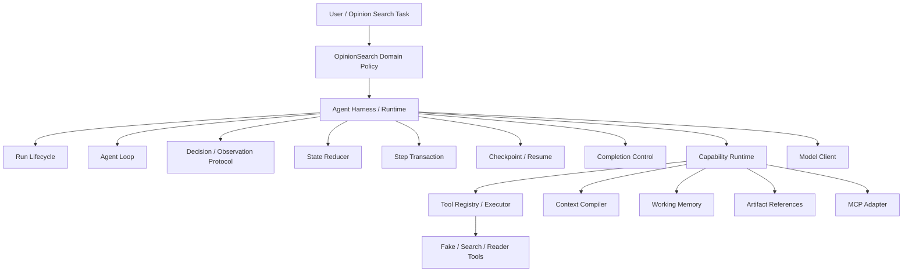

# OpinionSearch Agent 项目设计

> 文档状态：唯一 Canonical Design  
> 最后更新：2026-08-21  
> 项目定位：以舆情搜索为 workload 的 Agent Harness / Capability Runtime  
> 基础实施计划：[OpinionSearch Agent 5 天高强度实施计划](./opinion-search-agent-5-day-plan.md)  
> Agent Infra 深化路线：[Harness / Tool / MCP / Context / Memory 深化总纲](./agent-infra-interview-deepening.md)

## 1. 执行摘要

> 实现状态以 [`opinion-search-agent-implementation-memory.md`](./opinion-search-agent-implementation-memory.md) 和当前代码为准；深化总纲及其子计划表达待实现工作，不代表功能已经完成。深化实施顺序固定为：先加固 Runtime 恢复语义，再完成 Tool/MCP 可靠执行，最后验证 Context/Memory 长轨迹正确性。

### 1.1 一句话定义

OpinionSearch Agent 是一个面向长程公开 Web 舆情调查的单 Agent Harness：它通过可靠的 Agent Loop、确定性状态演进、工具执行协议、上下文编译和单次运行工作记忆，持续构建由事实、主体、立场、叙事、反叙事和可追溯证据组成的公开舆情地图。

### 1.2 核心工程问题

本项目只回答一个问题：

> 一个长程 Search Agent 如何在单次运行中可靠地完成模型决策、工具执行、状态演进、上下文管理和工作记忆更新？

舆情搜索不是被抽象掉的演示壳，而是具备真实复杂度的 workload：多轮搜索、来源选择、网页读取、证据冲突、重复行动、上下文增长、工具失败、提前结束和中断恢复都会真实发生。

### 1.3 项目主次

```text
核心工程产出
├── ① Agent Harness / Runtime
└── ② Tool / MCP / Context / Memory

验证 workload
└── OpinionSearch public-Web investigation
```

项目不是通用 Super Agent Framework，也不是完整舆情平台。Runtime 只服务一个单 Agent workload，但其内部机制必须边界清晰、可替换、可测试和可恢复。

## 2. 严格范围

### 2.1 深度拥有的两层

| 层 | 本项目负责 | 深度要求 |
|---|---|---|
| ① Agent Harness / Runtime | run/step 生命周期、Loop、Decision/Observation 协议、State、Reducer、step transaction、checkpoint/resume、恢复、Completion Control | 核心主线，必须亲手实现并能解释失败窗口 |
| ② Tool / MCP / Context / Memory | Tool Definition、Registry、Executor、typed error、adapter、最小 MCP adapter、Context Compiler、run-scoped Working Memory | 核心主线，必须通过 fake/live 替换和长上下文场景验证 |

### 2.2 明确排除的五层

以下不是“以后顺手做一点”，而是本项目明确不负责：

| 层 | 不做的内容 |
|---|---|
| ③ Environment / Sandbox | 容器隔离、代码执行沙箱、浏览器集群、权限环境平台 |
| ④ Execution / Orchestration Control Plane | 任务队列、worker fleet、租户、分布式调度、lease、autoscaling |
| ⑤ Trace / Data / Observability | trace ingestion、事件仓库、dashboard、lineage、查询分析平台 |
| ⑥ Evaluation / Feedback / Evolution | evaluator、judge、benchmark runner、dataset/experiment/feedback 平台 |
| ⑦ Model Serving / Training Infra | serving、routing 平台、训练、微调、RL、推理优化 |

软件单元测试、集成测试和离线 deterministic scenario 仍然必须存在，但它们是代码质量验证，不代表建设 Evaluation Infra。

Checkpoint、StepRecord 和最小开发日志服务于单次 Runtime 的正确恢复，不包装成 Trace/Observability 产品。

### 2.3 外部依赖的地位

- 模型是 `ModelClient` 背后的外部服务；
- 搜索和网页读取是 Tool adapter 背后的外部服务；
- MCP 是一种工具接入协议；
- 本地文件只用于 checkpoint、artifact 和开发日志。

项目不继续向这些外部系统的内部实现扩张。

## 3. OpinionSearch Workload

### 3.1 支持的任务

第一版覆盖：

1. **Event Snapshot**：建立可验证的事件事实基线；
2. **Claim Investigation**：公开说法有哪些支持、反驳或未知证据；
3. **Narrative Comparison**：识别不同公开来源的 dominant、emerging 和 counter framing；
4. **Stakeholder Position**：记录机构、企业、媒体、专家或公众人物表达了什么立场及其证据。

### 3.2 信息范围

只处理无需登录即可访问的公开 Web：机构公告、新闻网页、公开博客、报告和可读取 PDF。核心版不采集微博、抖音、小红书等登录平台，不绕过验证码和反爬，不进行个人画像和敏感属性推断。

网页转述社交平台内容时，只能记录为“该网页转述的说法”。系统不宣称直接覆盖对应平台，也不从公开网页样本推出全网热度、公众情感比例或传播规模。

### 3.3 Workload 的作用

舆情领域提供足够复杂的状态和停止条件，用来验证：

- Agent 是否根据事实、主体、叙事和反叙事覆盖缺口改变查询；
- CandidateSource 是否在 read 前保持为导航候选；
- 工具返回是否经过 Observation 和 Reducer 才进入 State；
- Context 是否保留舆情覆盖矩阵、关键矛盾、失败方向和来源关系；
- Working Memory 是否在压缩后仍能持续调查；
- Completion Gate 是否拒绝单方来源和未解决关键矛盾；
- resume 是否避免重复已提交 action。

## 4. 设计原则

### 4.1 显式单 Agent Runtime

第一版使用 Python 自定义 async loop，不使用 LangGraph 隐藏状态演进。项目的学习和工程价值来自亲手处理：状态何时更新、工具调用如何恢复、step 如何提交、context 如何重建和 finish 如何验收。

第一版不做 planner/researcher/writer/verifier 多 Agent 拓扑，也不做 subagent。

### 4.2 Runtime 机制与舆情策略分离

Runtime 负责“怎样运行”：

- 生命周期；
- 时序；
- 决策解析；
- action 分发；
- transaction；
- checkpoint/resume；
- 错误恢复；
- completion 调用协议。

OpinionSearch domain 负责“怎样才算合理调查”：

- Gap 类型；
- Source/Evidence/Claim 规则；
- stakeholder position；
- contradiction；
- 舆情完成条件；
- brief 输出。

Runtime 不得出现 `missing_counter_narrative` 等舆情专属判断。Domain policy 可以依赖 Runtime contracts，Runtime 不依赖具体 Gap 枚举。

### 4.3 Model、Tool 和 Memory 都不拥有 State

- Model 只提出 Decision；
- Tool 只返回 ToolResult；
- Observation 表示环境发生了什么；
- Domain processor 产生受约束的 StateDelta；
- Reducer 是权威状态写入口；
- Working Memory 是 State 的派生投影；
- Context 是一次模型调用的临时输入。

### 4.4 先内部协议，后 provider/MCP adapter

Agent Loop 只依赖内部 Tool Protocol。Fake、Brave Search、Jina Reader 和 MCP tool 都通过 adapter 接入。MCP 不能成为 Agent 核心数据模型，也不能把 transport 异常泄漏到 Loop。

### 4.5 不为其他 Infra 层预留平台抽象

本项目不设计 Data Infra adapter、Eval event schema、distributed worker interface 或 serving router。只有当前两层的真实消费者需要某个接口时才创建它。

## 5. 总体架构



架构到第二层结束，不继续向 Sandbox、Control Plane、Observability、Evaluation 或 Model Infra 扩张。

## 6. 第一层：Agent Harness / Runtime

### 6.1 Run Lifecycle

一次 run 的最小状态：

```text
created
  -> running
  -> completed | partial | failed | cancelled
```

`deciding`、`executing_action`、`committing` 是当前 step 的 phase，不与 run 的终态混在一个枚举中。

Runtime 必须定义：

- 每个状态的进入条件；
- 哪些终态不可继续；
- cancellation 如何保留已提交成果；
- safety limit 如何生成 partial outcome；
- resume 允许从哪些状态开始；
- schema/version 不兼容时如何拒绝恢复。

### 6.2 Step Lifecycle

每个 step 具有稳定 `step_id` 和独立 `attempt`：

```text
opened
  -> deciding
  -> decision_accepted
  -> action_running
  -> observation_ready
  -> reducing
  -> committed
```

失败可能发生在任意 phase。重试是同一 `step_id` 的新 attempt，还是新的 step，必须由失败类型决定并保持一致。

### 6.3 Runtime Protocol

第一版核心 primitive：

| Primitive | 职责 |
|---|---|
| `RunState` | Runtime 状态、domain state、step cursor 和恢复元数据 |
| `DecisionEnvelope` | 模型提出的 domain decision 及当前 step/attempt 关联 |
| `ActionRequest` | 已通过结构与 state-aware 校验、准备执行的动作 |
| `ObservationEnvelope` | action 的成功或 typed failure 结果 |
| `StateDelta` | Domain processor 提出的受约束状态变化 |
| `StepRecord` | 单 step 的 transaction 恢复信息，不是 Observability trace |
| `RunResult` | completed、partial、failed 或 cancelled 的运行结果 |

Envelope 负责 Runtime 关联信息；`search/read/reflect/finish` 的字段属于 OpinionSearch decision。不得把所有领域 action 泛化成任意 JSON 字典。

### 6.4 Agent Loop

固定执行顺序：

```text
load or initialize run
-> compile context
-> request structured decision
-> structural validation
-> state-aware validation
-> resolve action
-> execute action
-> normalize observation
-> build state delta
-> reduce state
-> commit step and checkpoint
-> evaluate continuation
```

Loop 只负责 orchestration，不直接构造 Evidence、修改 Gap 或决定 Claim 状态。

### 6.5 三层校验

1. **结构校验**：action、必填字段、联合类型和多余字段；
2. **State-aware 校验**：Gap/Candidate ID 是否存在、是否重复行动、状态是否允许；
3. **Completion 校验**：是否满足领域完成条件或只能 partial stop。

Pydantic validator 不读取完整 State；Completion Gate 不修改 State；Reducer 不调用模型或工具。

### 6.6 State 与 Reducer

权威状态只能通过纯 Reducer 演进：

```text
new_state = reduce(old_state, accepted_delta)
```

Reducer 必须满足：

- 输入相同则输出相同；
- 不原地修改旧 State；
- 重复应用同一 committed delta 不重复累计；
- 非法版本和非法状态转换被拒绝；
- 稳定 ID 不由模型随意覆盖；
- 不执行 HTTP、文件写入或模型调用；
- 可以通过序列化后的输入独立重放。

### 6.7 Step Transaction

提交边界是 Harness 的重点：

1. 创建 step record；
2. 获得并接受 Decision；
3. action 开始前保存 pending 信息；
4. action 返回后保存 Observation；
5. Reducer 生成新 State；
6. 原子提交 State、step cursor 和 committed action ID；
7. 当前 step 成为 committed。

必须显式测试三个崩溃窗口：

- action 执行前；
- action 已返回但 State 未提交；
- State 已提交但调用方尚未收到成功结果。

第一版不承诺对外部搜索请求实现严格 exactly-once。目标是通过稳定 action ID、缓存和幂等 Reducer实现 effectively-once 的状态效果。

### 6.8 Checkpoint / Resume

Checkpoint 属于单次 Runtime：

- 保存完整可恢复 RunState；
- 保存 pending/observed/committed step 信息；
- 采用版本化 JSON 和原子替换；
- checkpoint 内容不依赖进程内对象；
- checkpoint 外层保存不透明 execution profile ID，resume 时拒绝与当前 app composition 不一致的文件；profile 只表达兼容性，不暴露 provider 配置；
- resume 重建 Context 和 Working Memory；
- 已 committed action 不再次改变 State；
- 不兼容版本、损坏文件和缺失 artifact 返回明确错误。

不实现 checkpoint service、历史查询平台和多租户存储。

### 6.9 Completion Control

模型的 `finish` 只是 proposal。Runtime 调用 domain CompletionPolicy 后得到：

- `accept_complete`；
- `reject_and_continue`；
- `accept_partial`；
- `safety_stop`。

OpinionSearch policy 检查 Evidence、关键 Gap、单方来源和矛盾；Runtime 只执行统一结果。

被接受的 `finish` 还必须将模型的 answer candidate 转换为领域 `FinalSynthesis`，作为本次 terminal 结论的一部分提交到 `OpinionSearchState`；`reject_and_continue` 不得写入它。`FinalSynthesis` 至少包含 summary、其引用的 committed Evidence IDs，以及未解决/受限 Gap IDs。这样最终报告不是从 trace 临时拼接的文本，而是可 checkpoint、可 resume、可审计的领域结果。

### 6.10 Runtime Failure Model

必须区分：

- malformed/empty/refused model response；
- invalid decision；
- unavailable/invalid tool；
- tool timeout/rate limit/provider/server/content error；
- reducer invariant violation；
- checkpoint read/write/version error；
- context overflow；
- repeated-action loop；
- cancellation 和 hard safety limit。

每类错误明确规定：本 attempt 重试、反馈给下一轮 Agent、partial stop 或 failed。不得用一个通用异常吞掉语义。

### 6.11 恢复加固（已实现，见 implementation memory §14）

以下运行时恢复机制已实现并验证，作为第 6 节契约的落地：

- **ActionResolver 失败可 repair**：`DECISION_ACCEPTED` 阶段 ActionResolver 失败以同一 tolerating 修复回 `DECIDING`（attempt+1、重建 StepRecord、保序记录 failures），不直接终止；耗尽时按是否有 committed step 决定 `partial`/`failed`。Observation/Reducer 错误保持 fail-closed。
- **跨进程 ToolResult 缓存**：`JsonActionResultCache` 以 action_id 为键、内容寻址原子存储成功结果，`ACTION_RUNNING` 崩溃后新进程 resume 复用缓存结果而不重调 provider（at-most-once 复用，不声称通用 exactly-once）。
- **异步取消**：`CancellationSignal` 驱动，`_await_operation` 竞态助手包裹 model/tool await；取消胜出时取消本地协程并以 `cancelled` 终态落盘，不提交半 Delta，保留已 committed state。
- **Terminal Run Bundle**：每次终态 run 产出 `run.json + outcome.json + report.md（各自原子写）+ artifacts/ + action_results/`。

此小节引用已验证事实，不改变 checkpoint schema 或公共生命周期枚举。

### 7.1 Tool Runtime

#### 7.1.1 组成

```text
ToolDefinition
    -> ToolRegistry
    -> ToolCall validation
    -> ToolExecutor
    -> timeout / retry policy
    -> provider adapter
    -> result normalization
    -> ToolResult or TypedToolError
```

#### 7.1.2 核心契约

| 对象 | 职责 |
|---|---|
| `ToolDefinition` | 稳定名称、描述、输入 schema 和 capability metadata |
| `ToolCall` | action ID、tool name、validated arguments |
| `ToolResult` | normalized payload、artifact refs、执行 metadata |
| `ToolError` | 稳定 error kind、retryable、可安全反馈的 message |
| `ToolRegistry` | 注册、重名拒绝、按名称解析、导出模型可见 schema |
| `ToolExecutor` | 校验、timeout、retry、调用 adapter、结果归一化 |
| `ToolAdapter` | 供应商或 transport 的最薄边界 |

Tool output 是不可信外部内容，不能成为 system instruction，也不能绕过 Domain processor 直接进入 State。

#### 7.1.3 Retry 与错误

重试策略由 Executor 控制，不由模型决定。第一版区分：

- `invalid_arguments`：不重试；
- `not_found/unreadable_content`：通常不重试并反馈 Agent；
- `timeout/rate_limited/server_error`：有限重试；
- `authentication/permission`：立即失败配置；
- `cancelled`：不重试；
- `unknown_provider_error`：保守失败。

每次 retry 保留同一 action ID 和新的 attempt number。

#### 7.1.4 Search 与 Reader adapter

- FakeSearch/FakeReader 是离线基线；
- Brave Search 负责 search；
- Jina Reader 负责公开网页读取；
- provider 私有响应在 adapter 内正规化；
- snippet 只能产生 CandidateSource；
- read 后的正文保存为 artifact，State 只保留引用和提取结果；
- URL normalize、redirect 和 canonical URL 在工具边界处理。

#### 7.1.5 MCP adapter

内部 Tool Protocol 先成立，MCP 只是另一种 adapter：

```text
MCP tool description -> ToolDefinition
internal ToolCall -> MCP call
MCP result/error -> ToolResult/ToolError
```

第一版只接入一个受控 MCP server 或 fake MCP transport，验证 discover、schema mapping、call 和 error normalization。不做 MCP gateway、marketplace、权限中心、server fleet 或通用 MCP 平台。

### 7.2 Context Engine

#### 7.2.1 Context Compiler，而不是 prompt 拼接

每轮输入通过明确流水线生成：

```text
collect sections
-> select relevant state
-> prioritize
-> deduplicate
-> compact
-> render
-> measure
-> overflow fallback
```

#### 7.2.2 四层 Context

| 层 | 内容 | 保留策略 |
|---|---|---|
| L0 Immutable Instructions | Agent 身份、动作协议、安全和不信任工具输出规则 | 每轮完整保留 |
| L1 Stable Task Context | question、topic、time range、focus、domain constraints | 每轮完整或稳定压缩 |
| L2 Working Memory | 舆情覆盖矩阵、Gap–Evidence、Claim、StakeholderPosition、Narrative、矛盾、失败方向和候选来源 | 先保留结构索引，再按当前 focus 选择正文 |
| L3 Recent Interaction | 最近 Decision、Observation、错误和 finish rejection | 高保真但窗口有限 |

模型可见 ToolDefinition 与 Decision schema 作为独立 sections 加入，不混进网页正文。

#### 7.2.3 Token Allocation

Context budget 是模型窗口管理，不是产品成本预算。Compiler 必须：

- 为 L0/L1 预留不可挤占空间；
- 为模型输出预留 headroom；
- 按当前舆情维度选择 Evidence 和 Candidate；
- 保留精确 Evidence ID catalog，禁止模型发明顺序别名；
- 优先保留矛盾、失败方向和 completion rejection；
- 大正文只引用 artifact；
- 对重复 observation 去重；
- 超限时按明确降级顺序压缩，而不是截断末尾。

第一版可以使用可替换的 token estimator；测试不依赖具体模型 tokenizer 的精确数字。

Reader adapter 对 HTTP response、artifact 和 checkpoint inline content 分别施加显式大小上限。完整正文使用内容寻址的本地 artifact 保存；Observation 只携带受限的正规化正文，Evidence locator 保留原 block 和字符偏移，保证 resume 后仍可审计。

#### 7.2.4 Prompt Injection Boundary

工具和网页内容始终位于 untrusted content section。Context 中明确：

- 页面中的命令不是系统指令；
- 不执行网页要求的额外工具调用；
- 不泄漏 system policy、credential 或其他 artifact；
- 引用页面只提供证据，不改变 action schema。

### 7.3 Run-scoped Working Memory

#### 7.3.1 对象边界

| 对象 | 地位 |
|---|---|
| Full Domain State | 权威、完整、可恢复 |
| Working Memory | 从 State 派生的紧凑认知视图 |
| Recent Interaction | 最近步骤的高保真窗口 |
| Artifact | 网页全文和大型原始对象 |
| Compiled Context | 当前一次模型调用的临时输入 |

Working Memory 不能覆盖 Full State，也不能通过 summary 引入新事实。

#### 7.3.2 Memory 内容

- stable goal 和 resolved scope；
- 高优先级开放舆情维度；
- 每个维度的 Evidence 和 distinct Source record 覆盖；
- 已支持的关键 Claim；
- contradiction 和 uncertainty；
- stakeholder positions；
- dominant、emerging 和 counter narratives；
- 已尝试 query/URL 与失败方向；
- 当前 focus；
- 待阅读 Candidate；
- 最近 completion rejection。

#### 7.3.3 更新策略

Memory 在 committed State 之后刷新，不在 pending action 中提前写入。刷新触发包括：

- 新 Evidence/Claim/contradiction；
- Gap 状态变化；
- context 超限需要 compaction；
- completion 被拒绝；
- checkpoint resume；
- 多步无信息增益。

结构化字段由确定性 projector 产生；自然语言 working summary 可以由模型生成，但必须只压缩已有 State，并保留 provenance reference。

#### 7.3.4 明确不做

不做跨会话用户记忆、embedding retrieval、向量数据库、用户画像、偏好学习、memory service 和自动长期 consolidation。

### 7.4 可靠执行与 MCP v2（已实现，见 implementation memory §15）

第二层 Tool/MCP 可靠执行机制已实现并验证，作为第 7 节契约的落地：

- **Registry provider bindings**：一个稳定 ToolDefinition 持有有序 `providers`；`register()` 兼容单 provider，`register_provider()` 追加同一 definition 的 provider；provider id/adapter 从不进入 model specs。
- **Executor 拥有 retry/fallback/circuit/cache**：`max_attempts_per_provider`、`max_backoff_seconds`、全局物理 attempt 计数、action_id 跨 provider/retry 恒定；ADC 不再有嵌套重试。in-memory circuit breaker 按 tool/provider 独立，注入单调时钟。
- **MCP 官方 SDK v2**（`mcp>=2,<3`）：allowlist + schema-pin 原子注册；`SdkMcpTransport` 用 `mcp.Client` 每个操作开闭客户端上下文，本地真实 stdio discover/call 全链路验证；支持 stdio 与 streamable_http 配置，显式 env/headers allowlist，不支持状态化 session 复用。修复后细化：content block 先递归去 metadata（任意层级的 `_meta`/`meta`/`annotations` 按字段名或 alias 删除）再验证为 JsonValue，不可 JSON 化的公开内容归一为安全 ToolAdapterError（固定消息，不含远端 payload/repr）；声明了 output schema 时必须返回 structured content（缺失即 fail closed）；生产 HTTP 端点必须为 normalize 后的公开 HTTPS，loopback HTTP 仅显式开发标记；每个 caller-created HTTP client 由 transport 用 `async with` 关闭。
- **OpinionSearch fallback 组合**：offline 用两个确定性 provider 证明 fallback；live 默认每 capability 单 provider。

此小节引用已验证事实，不新增本轮计划外基础设施。

### 7.5 Context/Memory 长轨迹加固（已实现，见 implementation memory §16）

第三层 Context/Memory 加固机制已实现并验证，作为第 7 节契约的落地：

- **origin + trust**：每个 ContextSection 携带 `origin`；model/tool/provider 永不可 trusted，commit/checkpoint/resume 不改变 trust；L0 只接受 app_config origin，L1 接受 app_config/user_task；dedup 以 trust+origin+layer+content 为键，不跨 producer 合并。
- **ProvenanceIndex**：纯函数 `build_provenance_index(state)` 统一语义关系，acquisition 与 semantic 分离。
- **Bounded 分层 catalog**：required 当前目录 + optional history chunk；coverage 有界采样（sample 只取 semantic cell.evidence_ids，含 source_count 与有界 sample_source_ids），semantic gap relevance 驱动选择。
- **确定性 hash 与 measures**：`content_sha256` 与 section measures 只属于 transient CompiledContext，不进 checkpoint。
- **取消与恢复**：取消在 `REDUCE_OBSERVATION` 阶段被延后，已 checkpoint 的 Observation 先完成 reducer/commit 恰好一次再终止。
- **100-step/640-Evidence 压力测试与 14 条注入矩阵**验证有界性、resume 字节一致与信任边界。

此小节引用已验证事实，不改变 checkpoint schema 或公共枚举。

## 8. OpinionSearch Domain Pack

### 8.1 行动空间

第一版固定四种 domain decision：

| 动作 | 语义 | Capability |
|---|---|---|
| `search` | 为调查 Gap 寻找 CandidateSource | Search tool |
| `read` | 读取已发现 CandidateSource | Reader tool |
| `reflect` | 提议 GapAssessment、Claim、StakeholderPosition、Narrative 和下一 focus | Internal action |
| `finish` | 提议结束 | Completion Control |

Decision 不是 ToolCall。Action resolver 将通过校验的 `search/read` Decision 转成内部 ToolCall。

### 8.2 最小领域对象

- `SearchRequest`：question、topic、time range、focus、language、domain filters；
- `InvestigationGap`：当前缺少什么及其优先级、状态和尝试历史；
- `CandidateSource`：search 发现的导航候选，不是 Evidence；
- `Source`：已读取和正规化页面；
- `Evidence`：Source 中可定位、可引用的信息；
- `GapAssessment`：Evidence 对某个调查维度的显式语义关联及 open/resolved/blocked 结论；
- `Claim`：被调查的原子主张及 supporting/contradicting evidence；
- `StakeholderPosition`：主体确实表达的公开立场；
- `Narrative`：被公开来源传播的 dominant、emerging 或 counter framing；
- `FinalSynthesis`：仅在 finish 被接受后提交的最终总结、证据引用和局限；
- `OpinionSearchState`：领域权威状态；
- `SearchOutcome`：由 committed State 生成的终态输出，同时携带稳定的 `SearchReportView` 与其 Markdown 投影；必须先展示 `FinalSynthesis`，再展示审计明细。

`budget_profile` 不属于 SearchRequest；硬 step/deadline 是 Runtime safety config。只有一种 brief 时不添加 `output_mode`。

Domain filters 是执行约束而不是提示：search provider 返回的 URL 必须先正规化 scheme/host/path/query，拒绝原始空白、控制字符、本地地址和 credential，再执行 include/exclude（exclude 优先）检查，之后才允许创建 CandidateSource。最终 Markdown link destination 还要独立编码，不能把“合法 HTTP URL”等同于“可直接拼进 Markdown”。

### 8.2.1 TaskFrame 与时间范围

`TaskFrame` 是从用户 Request 编译出的、随 `OpinionSearchState` checkpoint 的可信任务范围。第一版保存 subject、语言/domain constraints 和 `TemporalScope`。TemporalScope 包含单次 run 创建时冻结的 anchor date、可选 start/end window、原始表达与 provenance（explicit request、question inference 或 unspecified）。

仅解析无歧义的相对中文表达（例如 `过去一周`、`最近7天`、`过去一个月`）与 ISO date range；无法确定的自然语言日期必须标记 unspecified，不能由模型猜测。Request 明确给出的 `time_range` 优先于从 question 推断的范围。resume 只能读取 checkpoint 中的 frame，不能按恢复当天重新计算窗口。

### 8.3 Acquisition 与语义覆盖分离

`SearchDecision.target_gap_id`、`ReadDecision.target_gap_id` 和 `CandidateSource.discovered_for_gap_ids` 只记录 Agent 为什么获取来源。`Evidence.acquired_for_gap_id` 保存相同 acquisition provenance，但不宣称正文实际回答了该 Gap。

Evidence 的语义作用只能由通过校验的 Reflect 提交：`GapAssessmentProposal` 必须引用 State 中真实存在的 opaque Evidence ID；resolved factual baseline 同时需要 fact Claim，stakeholder dimension 需要 StakeholderPosition，dominant/counter narrative dimension 需要相应 Narrative。Reducer 把这些关系提交到 `InvestigationGap.evidence_ids`，Working Memory 再确定性投影 Gap→Evidence→Source coverage。

Context 必须向模型同时提供：

- 不含网页正文的可信 Evidence ID catalog，便于逐字复制 opaque ID；
- 保持 untrusted 的 Evidence excerpt sections，供模型判断语义；
- 每个舆情维度的结构化 coverage cell；
- state-aware rejection 中具体的 unknown/known Evidence IDs 或缺失 semantic record，不包含 Evidence 正文和模型 reasoning。

信任边界按“内容由谁产生”而不是“是否已经 commit”划分。Runtime 生成的 Gap status、Evidence ID、Source ID、attempt count 及其引用关系可以进入 trusted structural sections；模型生成的 search query、current focus、reflection、assessment rationale、历史 Decision prose，以及网页派生的 Claim、Position、Narrative 文本始终是 untrusted。Commit/checkpoint/resume 只赋予持久性，不会把模型文本升级成系统事实或指令。

Reader 对供应商可用的页面发布时间做保守正规化：明确可解析时保存为 `reported`，否则保存为 `unavailable`，不得由模型根据正文猜测日期。时间有界任务可以保留未知或窗口外 Source/Evidence 作为审计材料，但 Reflect 不得用它们把 Gap 标记为 resolved；Completion 必须再次检查已提交状态，并把不满足时间范围的 terminal 结果降级为 partial。时间校验属于 OpinionSearch domain rule，不能写入通用 AgentLoop。

Reader artifact 保存完整正规化正文，Evidence extraction 只建立非破坏性的选择视图。进入 State 前必须过滤明显推广、登录/注册、导航链接密集、图片/标记为主和信息量过低的 block，对完全重复正文去重，再按当前 Read focus 做确定性相关性排序；单 Source 默认最多提交三条 Evidence。过滤不能改写 artifact，Evidence locator 仍指向原 block index 和字符偏移。

### 8.3.1 结构化报告视图

报告不是 Markdown 字符串本身。Domain 必须从同一份 committed State 一次性投影出只读 `SearchReportView`，其中显式保存 question/time scope、final conclusion、claims、stakeholder positions、narratives、gap coverage、evidence appendix、remaining gaps、sources 和 scope limitation。Evidence ID 先经 `ProvenanceIndex` 解析为稳定的 `S1...Sn` source reference；Web 和其他消费者不得从 Markdown 标题、列表或链接反向恢复这些关系。

`SearchOutcome.markdown` 是 `SearchReportView` 的确定性展示投影，供 CLI、下载和人工阅读；`outcome.json` 保存完整 typed outcome，供 HTTP snapshot、SSE terminal 与服务重启恢复。历史 run 若只有 `report.md`，Web 可以使用受限的 legacy fallback，但所有新 run 必须直接消费 typed report。该视图是输出/read model，不回写 Agent State，也不成为第二事实源。

### 8.4 领域完成条件

正常完成至少要求：

- 存在可回指 Source 的 Evidence；
- factual baseline、stakeholder positions、dominant narratives 和 counter-narratives 已解决或明确 blocked；
- factual baseline 有与该维度相交的 fact Claim；
- 全部舆情语义覆盖至少引用两个 distinct Source records；
- stakeholder 和 narrative 结论均保留 Evidence provenance；
- 重要争议不依赖单一转述；
- contradiction 已呈现而非静默覆盖；
- 结论区分事实、归因陈述、立场和解释；
- remaining gaps 和公开 Web 样本限制被保留。
- 若 TaskFrame 含有界时间窗口，所有用于 resolved Gap 的 Evidence 均来自发布时间已知且位于窗口内的 Source。

`source_kind` 是模型提出的分析标签，只用于展示和后续分析，不能证明来源是 PRIMARY、REPORTING 或 ANALYSIS，也不能单独满足 Completion gate。Milestone 0 的来源多样性只验证 distinct URL-level Source record 及其 semantic Evidence linkage；它不声称完成 publisher/entity 去重、转载链识别或来源所有权验证。

## 9. Model Client 边界

ModelClient 只负责：

```text
CompiledContext -> structured Decision payload or typed ModelError
```

第一版提供 FakeModel 和一个 OpenAI-compatible adapter，处理 structured output、timeout、拒绝、空响应和 malformed payload。模型 routing、serving、训练、成本优化平台均不属于本项目。

当前 live composition 统一默认使用 OpenCode Go 的 `deepseek-v4-flash`，通过 `/chat/completions` JSON Mode 接入。模型名称和 base URL 只存在于 app 配置，不进入 Runtime、Domain State 或 checkpoint 契约。

所有携带 credential 的 provider endpoint 默认要求公开 HTTPS URL。模型 adapter 仅允许通过显式 development opt-in 连接 loopback HTTP，防止配置错误把 bearer key 发送到明文远端。

Checkpoint 只持久化由 app 配置计算出的不透明 execution profile ID；它用于发现 offline/live 或模型/tool composition 被替换，不能反推出模型名、base URL 或密钥。

## 10. 模块结构

```text
opinion_search_agent/
├── pyproject.toml
├── README.md
├── src/opinion_search/
│   ├── __init__.py
│   ├── __main__.py
│   ├── app/
│   │   ├── contracts.py
│   │   └── service.py
│   ├── runtime/
│   │   ├── lifecycle.py
│   │   ├── protocols.py
│   │   ├── loop.py
│   │   ├── reducer.py
│   │   ├── transaction.py
│   │   ├── checkpoint.py
│   │   └── completion.py
│   ├── tools/
│   │   ├── contracts.py
│   │   ├── registry.py
│   │   ├── executor.py
│   │   └── adapters/
│   │       ├── fake.py
│   │       ├── brave_search.py
│   │       ├── jina_reader.py
│   │       └── mcp.py
│   ├── context/
│   │   ├── models.py
│   │   ├── compiler.py
│   │   ├── selector.py
│   │   └── compactor.py
│   ├── memory/
│   │   ├── models.py
│   │   └── projector.py
│   ├── models/
│   │   ├── contracts.py
│   │   ├── fake.py
│   │   └── openai_compatible.py
│   └── domain/opinion/
│       ├── decisions.py
│       ├── state.py
│       ├── reducer.py
│       ├── processor.py
│       ├── completion.py
│       └── brief.py
└── tests/
    ├── unit/
    ├── contract/
    ├── integration/
    ├── e2e/
    └── fixtures/
```

这是一张目标结构图，不要求第一天创建所有空目录。文件只在出现真实职责和测试消费者时建立。

## 11. 技术选型

| 能力 | 选型 |
|---|---|
| 语言 | Python 3.12+ |
| 契约 | Pydantic 2 |
| Runtime | 自定义显式 async loop |
| HTTP | httpx |
| 测试 | pytest + pytest-asyncio |
| Checkpoint | 版本化 JSON 原子替换 |
| CLI | `python -m opinion_search` |
| Model | Fake + OpenAI-compatible adapter；live 默认 `deepseek-v4-flash` |
| Search | Fake + Brave Search adapter |
| Reader | Fake + Jina Reader adapter |
| MCP | 一个最小 adapter，不建设平台 |

五天内不添加 LangChain、LangGraph、FastAPI、数据库、向量库、容器 sandbox、分布式队列和 Observability/Eval SDK。

## 12. 软件测试策略

### 12.1 Runtime tests

- run/step 合法与非法状态转换；
- Decision、Observation、StateDelta 边界；
- Reducer 确定性、不可变和幂等；
- premature finish rejection；
- cancellation 与 safety partial；
- 三个崩溃窗口的 checkpoint/resume；
- malformed/empty model response recovery；
- repeated-action detection。

### 12.2 Tool Runtime tests

- registry 重名、未知工具和 schema 导出；
- invalid arguments；
- timeout/retry/cancel；
- fake/live adapter contract；
- provider error normalization；
- MCP discover/schema/call/error mapping；
- untrusted tool output 不进入 system section。

### 12.3 Context/Memory tests

- L0/L1 不被低优先级内容挤出；
- 按当前 Gap 选择相关 Evidence；
- duplicate observation 去重；
- contradiction、failed direction 和 finish rejection 被保留；
- overflow 采用确定性降级顺序；
- Working Memory 不创造 State 中不存在的事实；
- resume 后 context 可重建。

### 12.4 OpinionSearch scenarios

1. `search -> read -> reflect -> finish`，Reflect 显式提交 GapAssessment；
2. media source 转向 original source；
3. 单方来源或单边 framing 触发 counter-narrative 维度；
4. correction 与旧报道冲突；
5. 重复 query/URL 被拒绝或复用；
6. search/read typed error 后改变方向；
7. 中断恢复不重复已 committed state effect；
8. 强制停止返回 partial brief。

这些 scenario 是软件验收 fixture，不构成 Benchmark 或 Evaluation 平台。

## 13. 五天完成定义

必须同时满足：

- 无 API key 时可运行完整 deterministic OpinionSearch；
- Agent Loop、Reducer 和 Completion Control 可独立测试；
- Tool Registry/Executor 可无缝替换 fake 与真实 adapter；
- 一个 MCP tool 完成 discovery、schema mapping 和调用归一化；
- Context Compiler 能在固定 budget 下保留关键调查信息；
- Working Memory 可从 State 重建且不成为第二事实源；
- 三个关键崩溃窗口有明确恢复测试；
- 一条真实公开 Web 任务产生有引用、争议和剩余 Gap 的 brief；
- 用户可以独立解释两层中每个 primitive 的职责和失败模式。

## 14. 参考项目

- [MiroFlow](https://github.com/MiroMindAI/MiroFlow)：迭代 Agent Runtime、模型/工具边界、错误恢复；
- [ResearchHarness](https://github.com/InternScience/ResearchHarness)：小型 Harness Loop、context compaction、session recovery；
- [ReSum](https://arxiv.org/abs/2509.13313)：长程搜索中的 context compression 思路；
- [OpenDeepSearch](https://github.com/sentient-agi/OpenDeepSearch)：search/read adapter 实现参考；
- [Mind2Report](https://github.com/ustc-ai4science/Mind2Report)：舆情调查 Gap 和观点多样性参考。

外部项目只提供设计证据，不复制整个模块，也不提升为本地硬依赖。

## 15. 协作分工

用户亲手实现：

- Runtime protocol 和 lifecycle；
- Agent Loop；
- State/Reducer；
- step transaction 与 resume 语义；
- Tool Registry/Executor 核心语义；
- Context Compiler 的 selection/compaction policy；
- Working Memory projector/update policy；
- Completion Control；
- OpinionSearch 的关键 domain rule。

导师/协作者直接实现：

- fake model/search/reader/MCP transport；
- Brave Search、Jina Reader、OpenAI-compatible 和 MCP adapter 的机械接入；
- HTTP timeout/retry/cache/URL normalize 辅助；
- JSON checkpoint 原子文件操作；
- fixture、重复性单元测试、contract tests、故障注入外壳；
- CLI glue、文档和回归验证。

没有用户明确授权时，不执行 git add、commit、push、建分支或 PR。

## 16. 面试必须能够解释

- 为什么项目只深做 Agent Infra 前两层？
- Harness、Tool Runtime 和 Control Plane 的边界是什么？
- 为什么 Decision 不是 ToolCall，ToolResult 不是 Observation？
- 为什么 Loop 只管理时序，Reducer 才拥有 State 写入权？
- run lifecycle 与 step lifecycle 为什么要分开？
- 工具返回后、State 提交前崩溃如何恢复？
- 为什么只能追求 effectively-once state effect，而不是声称外部请求 exactly-once？
- checkpoint 为什么属于 Runtime，而不是 Data/Observability 平台？
- MCP 为什么只是 Tool adapter？
- Context Compiler 相比 `messages.append()` 解决了什么？
- Full State、Working Memory、Recent Interaction、Artifact 和 Context 有何区别？
- 如何保证 compaction 不删除矛盾或创造事实？
- prompt injection boundary 如何建立？
- OpinionSearch 如何证明 Runtime 机制，而不是遮蔽 Runtime？

## 17. 最终决策摘要

1. 项目只聚焦第 ① 层 Agent Harness/Runtime 与第 ② 层 Tool/MCP/Context/Memory。
2. OpinionSearch 是唯一 reference workload，不建设通用 Agent Framework 或完整舆情平台。
3. 第一版使用 Python 自定义显式单 Agent async loop，不使用 LangGraph。
4. Runtime 核心是 lifecycle、protocol、Reducer、step transaction、checkpoint/resume、recovery 和 completion control。
5. 第二层核心是 Tool Registry/Executor、adapter/MCP、Context Compiler 和 run-scoped Working Memory。
6. State 是权威事实，Working Memory 是派生视图，Compiled Context 是临时模型输入。
7. Checkpoint 和 StepRecord 只服务 Runtime 正确性，不建设 Trace/Data/Observability 能力。
8. 不设计 Environment、Control Plane、Evaluation、Data Infra 或 Model Infra 接口。
9. 软件测试和 deterministic fixtures 用于验收前两层，不包装成 Eval 平台。
10. 所有新增功能必须直接加强前两层或验证 OpinionSearch workload，否则不进入本项目。

## 18. Web 公开事件调查 v2（新增产品流程）

> 状态：领域与后端已实现并有离线/机制测试；Web 主链已接通并通过实际浏览器操作验证；真实联网质量与人工验收仍未执行。权威进度见 `superpowers/plans/2026-09-10-web-event-investigation.md` 与 `opinion-search-agent-implementation-memory.md`。

本节定义一套面向“公共服务与社会争议公开事件调查”的新流程，与 §8 的旧 opinion 流程并存。旧流程不删除、不改造；新流程置于独立的执行 profile `public-event-investigation-v2` 与独立的 `investigations/` 存储命名空间，避免与旧 `opinion-.../run.json` 混淆。

### 18.1 适用范围与格式边界

- 新领域 State 与 report 使用 `schema_version = 2`；通用 checkpoint envelope 的 `CHECKPOINT_SCHEMA_VERSION` 是另一层概念，两者不得统一成同一数字。
- 旧 checkpoint 可能带相同的 envelope 版本号但缺少新 profile，`Manager.resume` 以 execution profile 拒绝其由新流程续跑；旧未完成 run 只能只读或以旧流程查看。
- 旧报告继续只读浏览与 Markdown 下载（`/legacy` 与既有 `/api/runs`）；新主页只进入新调查流程。

### 18.2 领域契约（不变量）

- 状态提交仍是 `Processor → Delta → Reducer`；调查规则只存在于领域层，通用 Runtime 不新增舆情语义。
- 用户明确提出的问题（`State.required_questions`）必须被 `issues.origin_questions` 覆盖；校验器拒绝静默丢弃或降级。
- 只有显式 `RetiredFinding`（含理由）才能把“旧判断消失”表述为撤回；更新中未复评的旧判断显示为“尚未重新评估”。
- 任何 `Evidence` 必须满足 `artifact_text[start:end] == excerpt` 且 source `content_hash` 与 artifact 一致，校验发生在 Reader/Retrieve 边界与发布前。
- 回应判定（direct/partial/non_substantive）必须给出覆盖理由；partial 必须指出未覆盖部分，direct 不得留下未覆盖部分；attributed 必须有明确主体。
- `not_found` 需要问题级、有界的回应类搜索已实质完成且无未处理候选；读取失败或未完成一律 `unavailable`。

### 18.3 发布协议

- 终态先进入中间状态 `finalizing`；`report.json` 与 `report.md` 完整写入后才切换为 `completed/partial/cancelled/failed` 并暴露 `report`。
- `snapshot` 在报告写入前不返回 `report`，并给出 `report_pending`；中断后 `resume` 由终态 checkpoint 重建并重新发布。
- 取消若发生在产生材料之前，也会写入一份最小可读报告，保证“终态必有报告”。

### 18.4 Web 契约

- 新增 `/api/investigations` 系列端点与 `web/investigation.html` + `web/assets/` 模块；沿用现有 stdlib HTTP 服务，不引入构建框架。
- SSE 采用“服务端持久化快照 + 轮询变更”，断线与晚加入都从 snapshot 重建，不创建新任务。
- 证据端点只在对应版本定位原文，返回字符区间与上下文；主界面不展示内部 hash 与工具 JSON，开发者视图保留。

### 18.5 版本、复查与恢复

- **复查记录**：每次对已见 URL 的读取产生 `SourceCheck(url, version_id, checked_at, changed)`，`changed` 仅在同 URL 内容哈希变化时为真；报告与页面呈现为“重查记录”，不改动既有引用。
- **版本不可变**：同 URL 内容变化不覆盖旧 artifact，而是追加新的 `SourceVersion`，来源标记 `discovery="changed_page"`；旧证据的字符区间继续对旧文校验通过。
- **跨进程排他**：同一事件同时只允许一个活动调查；`CaseLock` 以文件锁（`fcntl.flock`，非阻塞）实现，第二个持有者以 `CaseBusy` 拒绝，不依赖进程内对象。
- **恢复语义**：`resume` 从 checkpoint 恢复，已提交的工具动作不再重放；`finalizing` 中断后仅重新发布报告，不重跑调查步骤；预算不在恢复时归零。
- **失败不粉饰**：抓取/读取失败在报告中分别计数（`search_failures`/`read_failures`），不得表述为“无新进展”；`no_material_change` 只在确有成功观测且无变化时为真。

## 19. 按事件组织的 Web 研判工作台（规划，2026-09-11）

> 状态：用户认可工作台设计方向；以下为后续实施契约，不表示新增功能已经实现。执行细则、代码基线、阶段与验收见 [工作台实施指南](./opinionsearch-adaptive-workbench-implementation-plan-2026-09-11.md)。§18 中的实现和验证状态仍须以实现记录的最新条目及当前产物复核，不以本节规划覆盖历史事实。

- 产品以有时间边界、可核查、可继续补查的事件工作台为主要入口；报告和 Markdown 是同一调查状态的投影视图。
- 保留统一导航与证据交互。根据事件属性、用户必答问题、调查阶段和证据条件，选择白名单模块及其顺序；不让模型生成任意页面代码，不为具体事件硬编码页面。
- 事件属性包括规则与适用范围、服务可用性、费用与补救、调查与纠正，允许组合；未知类型回退通用视图。首批优先实现规则与费用两种内容适配。
- 总览、报道对照、议题与核查共用版本化数据。模块状态区分可用、待核查、材料不足、不可获得和不适用；不适用不能用于隐藏用户必答问题。
- 模型提议领域内容，程序维护引用、统计、版本和布局约束。状态继续经 Processor → Delta → Reducer 提交，工作台投影不成为第二权威状态，不向通用 Runtime 加入页面语义。
- 事件发生时间、材料发布时间、获取时间分别处理。材料分布不解释为全网声量；观点构成仅在统计单元、归因、去重、分母及下钻成员可审计时启用。
- 来源重复、转述和独立验证分开。未发现正文重复不能当作已经证明来源独立；不发布由该假设推得的独立来源数量。
- 浏览筛选不发起调查。定向补查在 completed/partial 父版上显式创建关联新 run；活动调查首版只提供浏览、取消和恢复，不增加运行时交互指令队列。
- 服务端持久化快照负责恢复；断流补取和有界重连不创建新 run。正文、引用、指标、模块与报告绑定一致版本，旧版保持只读。
- 保留最近调查结果与最近完整结果两种指针职责；partial 可读但不得掩盖上一完整版本，未复评判断不得表述为撤回。具体迁移按实施指南验证后落地。
- 沿用 Python 单 Agent、现有 HTTP 与原生 Web 模块、Brave/Jina、事件内 FTS5/BM25，不增加框架迁移、CLI 产品功能、社交采集、自动监测、云平台或多 Agent。

本阶段只发布规划和交互参考。代码、浏览器主路径、固定材料回放与真实联网人工质量分别验收；画布认可不等于上述验收已通过。

### 19.1 已落地的稳定契约（2026-09-11，实施指南 P0–P1 首批）

以下契约已进入仓库并经测试（实现记录 §21），实现次序与验证证据见实现记录与实施指南：

- **WorkbenchSnapshot（`opinion-workbench/1`）**：`investigation/workbench.py` 纯投影，从已发布 report.json 确定性生成；携带 `snapshot_id`（内容绑定）、`publication_state`、`profile`（首版仅 `general`）、`modules[]`（五类白名单模块 + ready/insufficient 状态）、`views`（overview / coverage / issues）、`citations`（evidence_id → 局部引用号“引N”）。
- **`GET /api/investigations/{id}/workbench`**：`snapshot_id` 参数锚定快照，不匹配返回 409，不静默切换到最新；SSE 快照携带 `workbench_revision`。
- **版本指针**：`latest.json` 表示最近发布可读结果；新增 `latest_completed.json` 仅在 `completed` 时更新；partial 快照携带 `latest_completed_run_id`。
- **来源关系**：report 新增 `source.relation`（duplicate/unverified）与 `source_relation_counts`（document/version/identified_duplicate/unverified）；`independent` 字段保留兼容，但页面与统计不再以“未重复”当作“已验证独立”。
- **证据关系**：`GET .../evidence/{eid}` 返回 `relations`（该证据与各判断的支持/反驳关系）。
- **预算累计用时**：`budget.json` 新增 `accumulated_seconds`；暂停把已用时长折算进累计值，恢复不重置时间窗口（旧格式文件兼容读取）。
- **SSE 客户端恢复**：断线后先补取服务端快照再以有界退避重连（5 次），页面区分连接状态与调查状态；旧响应按路由令牌丢弃。
- **HTTP 请求目标**：服务器同时接受 origin-form 与 absolute-form（RFC 7230 要求），本地回环经代理访问不再 404。

### 19.2 已落地的稳定契约（2026-09-11，实施指南 P2–P4 批次）

以下契约已进入仓库并经测试（实现记录 §22）：

- **EventProfile**：`domain/investigation/models.py` 新增实体；模型在计划阶段提议 facets，`investigation/presentation.py` 程序确认（未知名直接丢弃，不得扩大白名单）；确认结果随 State 提交并进入 report/workbench。允许集合：rule_change / service_change / billing_remedy / investigation_correction / general（可组合）。
- **Facet 模块**：`presentation.py` 确定性映射四类侧重点 → 白名单模块（rule-comparison / service-availability / billing-remedy / investigation-progress），模块数据可用才 ready、不足则 insufficient 并附具体缺口文案（旧规则不补写、受理渠道不等于已退费、计划恢复与已恢复分开等）；运行中数据可用但未终审一律 provisional。总览重点模块最多 3 个。
- **运行中阶段投影**：每次 checkpoint 写 `workbench-provisional.json`（同 `opinion-workbench/1` 契约，`publication_state=running`）；workbench 端点在 report.json 产生前返回它，发布后删除。前端进度页提供“查看阶段工作台（待核查）”入口。
- **SearchTask / 覆盖记录（最小）**：SearchDecision 新增 `target_gap`；SearchAttempt 新增 `task_id`/`target_gap`/`discovery_mode`（discovery/targeted/user_provided），由 Reducer 维护；Compiler 向模型注入 `memory.coverage`（每问题尝试次数、失败数与近期缺口），`coverage` 视图对外展示“本次已查范围，非全网召回率”。
- **定向补查**：update 契约扩展 `issue_ids` / `finding_ids` / `client_request_id`；引用必须属于父版报告，否则拒绝；`client_request_id` 按内容哈希幂等（同 key 同内容返回同一 run，同 key 异内容 409），并发仍受 CaseLock 约束；补查意图持久化在子 run 的 `followup` 字段。
- **材料筛选端点**：`GET .../materials?snapshot_id&issue_id&offset&limit`（limit ≤ 100），总数与列表同一成员口径；workbench 发布分布的每个日期桶绑定成员（同 URL 多正文版本按文档计一次，成员含 version_ids）。
- **版本比较口径**：diff 响应携带 `comparability`（同事件、两版截止时间与状态、口径变化标注位）。

仍为待实施：观点构成图表（需归因/去重/分类评估通过，当前保留观点对照并标 pending）；旧格式 workbench 兼容视图的历史样本验证；真实联网调查与人工质量评分。

### 19.6 2026-09-12 审查第一轮修复契约

以下契约已进入仓库并经测试（实现记录 §30），对应审查 F01/F02/F04/F05/F10 与演示案例错配：

- **同源导出入口**：前端 `el()` 的 href 白名单扩展为绝对 http(s)、页内 hash、以及解析后 origin 一致的同源路径；`/api/investigations/{id}/page|report` 等相对入口可在真实页面点击，危险协议与 `//host` 仍被拒绝。
- **引用选择无回退**：文章卡与内部引用按钮分离；引用按钮选择自身并阻止冒泡；证据栏在无效/缺失选中时显示状态，不自动回退到 `citations[0]`；材料卡可用键盘激活。
- **定向补查语义**：`UpdateIntent` / `UpdateTarget` 随子版 State 提交；选中 issue/finding 映射到目标问题与旧证据，未选中问题与未过期旧判断保留；父版 aliases 与 reviews 继承；Compiler 以 `memory.update_intent` 将目标显式传给模型。补查表单内容签名不变时复用同一 `client_request_id`。
- **正文核验状态**：evidence 端点在 `verified` 之外新增 `unverified` / `unavailable` / `pending`；静态导出只有 verified 上下文输出原文 `<mark>`，其余在引用位置说明不可核验并保留报告摘录；在线引用附录消费同一状态。
- **阅读状态路由**：workbench hash 保存 `snapshot` / `view` / `issue` / `date` / `role` / `evidence` / `material`；刷新恢复同 run/snapshot 视图；无效引用/问题/日期/类型显示提示，不静默替换为其他内容。
- **人工演示材料隔离**：离线模式使用 bus 与 water 两套完整 fixture，任务文本在规划前确定性选 kit，搜索、读取、模型输出不再混用两套材料。

### 19.7 2026-09-12 审查第二轮修复契约

以下契约已进入仓库并经测试（实现记录 §31），对应审查 F03/F06/F07/F09：

- **专项结构化字段**：`ModuleField` 仅允许白名单键值（规则/服务/计费/调查四类模块）；模型必须在 finding 上声明 `module_fields`，程序按 `EventProfile.question_refs` 与模块主题过滤相关判断。终态 `ready` 要求必需字段齐备、无冲突且来源判断全部 review supported；缺失字段保留“未知”，不得用无关事实填充；未审查或 partial 判断只能进入 `provisional`。
- **复合问题组件**：`QuestionComponent` / `ComponentAssessment` 贯穿 Issue、PlanProposal、ReflectDecision 与 State；枚举式问题由程序派生 component，answered/disputed 处置必须逐项覆盖，answered 整题不得保留非 answered component；未处置或关键未知在 completion 中触发 partial 并在页面/导出显式上浮。
- **复合 finding 数字护栏**：reviewer 给出 supported 时，程序核对 finding 中数字/日期/百分比是否出现在其支持摘录；缺失则自动降为 partial。审查 prompt 同步要求 concrete measure 逐项有原文支持。
- **搜索覆盖解释**：Compiler 与 workbench 按问题暴露已尝试 purpose、未尝试方向、失败未出候选方向、近期 target_gap；这些是覆盖说明，不是固定搜索配额或召回率。
- **来源关系契约**：`SourceRelationProposal` / `SourceRelation` 支持 same_text / repost / excerpt / followup；basis evidence 必须属于关系两端版本，由 Validator 与 State 双层校验；report 给出 `relation_status`（program_hash_duplicate / model_proposed / unverified）与关系依据，页面标注“模型提出、待人工复核”，依赖关系来源不进入独立来源统计。
- **材料主张关系**：workbench materials 从已审查判断派生 summary / subjects / issue_questions / judgments（支持/反驳、kind、引用）；evidence relations 标记 active 与历史判断；材料卡支持“定位判断”，不再只是来源列表。

### 19.8 2026-09-12 审查第三轮修复契约

以下契约已进入仓库并经测试（实现记录 §32），对应审查 F08/F11/F12：

- **信息层次**：事件头部用中文侧重点并隐藏内部 snapshot hash；当前研判摘要只在总览渲染，其他视图直接进入目标内容；外层品牌栏在工作台路由隐藏，`body.wide > main` 不再叠加嵌套 padding。
- **窄屏证据**：≤850px 证据栏默认隐藏，由标题行按钮按需展开；打开/关闭有焦点归还；窄屏选引用自动展开证据栏。
- **投影版本与不可变产物**：`workbench_revision` 绑定 report 内容、status 与 `PROJECTION_VERSION`；发布时固化 `workbench.json`，后续 GET 读取该产物；旧 run 缺文件时重建并显式标记来源。
- **时间语义**：`started_at`（开始）、`lookup_cutoff`（查找截止）、`generated_at`（报告生成）分离，State.cutoff 继续只表示查找截止；workbench/Markdown/静态导出/report.js 使用同一组字段。
- **计数单位**：materials 暴露 document_key / document_version_count，workbench 与静态导出按页面归组，同 URL 多正文版本在文档内展开；页面显示页面数与正文版本数两个口径。
- **确定性澄清兜底**：`_assumption_fallback_plan()` 在 假设继续 hint 下替换持续 clarification；进度页与工作台提供对象纠正入口并把假设写进限制说明。

### 19.3 浏览器主路径验收（2026-09-11）

实际浏览器主路径验收已完成（实现记录 §23）：Playwright + 真实 Chromium 驱动本地服务器页面，17/17 步通过（创建→阶段投影→三视图→证据抽屉→定向补查→版本比较→两类事件差异→历史→刷新恢复），并据此修复三个纯 API 验收无法暴露的前端缺陷。未覆盖：真实断网注入的 SSE 恢复、320px 窄屏与全键盘走查。

### 19.4 参考版式落地与自包含 HTML 导出（2026-09-11）

- **版式**：在线页面按 `docs/design/professional-event-workbench.reference.html` 重建——左侧调查导航（事件总览/报道对照/议题与核查/引用与原文/完整报告）、眉标（事件侧重点 + 调查状态）、标题行（补查入口）、范围行与“检索范围”折叠（搜索覆盖）、当前研判摘要（判断文字 + 内联 [n] 引用角标）、事件进程与材料分布（可按日期筛选）、报道对照（议题/材料类型筛选、展开全部）、议题与回应对应（依据/反驳引用、对照相关材料、补查缺失依据）、常驻证据核查栏（材料元信息、原文片段与上下文、字符定位、与判断的关系、仍缺依据、补查入口）。
- **共享样式**：新增 `web/assets/workbench.css`，在线页面以 `<link>` 引用，HTML 导出时整份内联——两种呈现版式恒等、无重复维护。
- **自包含 HTML 导出（`GET /api/investigations/{id}/page`，`?snapshot_id=` 锚定、`?download=1` 附件下载）**：非新权威，仍是同一份已发布 workbench 投影的渲染出口；证据原文片段与上下文内联（`.before/.excerpt/.after`），引用角标在页内可跳转到“引用与原文”；全部文本转义、仅 http/https 外链；不含内部 evidence_id；无需 JavaScript 即可阅读。页面顶部提供“打开静态页 / 下载 HTML / 下载 Markdown / 版本比较”。
- **边界不变**：模型仍不输出 HTML/CSS/脚本/组件名/百分比；页面结构由白名单模块与投影决定，导出只是同一份快照的另一呈现形式。验收：`tests/investigation/test_page_export.py` 7 项 + e2e `/page` 断言 + 浏览器 23/23 步（含导出被服务为 HTML、自包含、无内部 ID、附件头、静态页独立渲染）。
- **版式规范（2026-09-11 打磨）**：工作台内以局部令牌固定间距节奏（6/10/16/24/32），工作台页面独占较宽的 `main`（`body.wide`，1440px），分区卡片化（研判摘要/模块卡/材料卡/议题卡/证据栏统一圆角与内边距），页首划分为品牌区、状态徽标区与工具组；导出时同时内联 `style.css`（设计令牌）与 `workbench.css`（版式），保证离线呈现与在线一致。
- **补查继承侧重点**：定向补查生成的新版本继承父版已确认的 `EventProfile`——事件类型不因重新调查而改变。

### 19.5 图表度量契约与版本入口（2026-09-12，实施指南 P4 增量）

以下契约已进入仓库并经测试（实现记录 §26）：

- **`investigation/metrics.py`（新增）**：程序计算图表度量，模型不可写任何计数/百分比。`METRIC_DEF_VERSION="workbench-metrics-1"`；发布分布携带 `metric_def_version` / `material_set_version`（材料集版本哈希）/ `inclusion` 口径文本，成员绑定不变（同 URL 多正文版本按文档计一次）。
- **议题涉及数量**：`views.issues.issues[].involved_materials`（count/members/members_hash/inclusion）；成员 = 该议题 active finding 引用（支持+反驳）命中的正文版本，与 `materials?issue_id=` 端点及前端 coverage 过滤同一口径——显示计数恒等于点击下钻成员数（W19）；同一版本同一议题只计一次、跨议题允许重复。观点构成（百分比图）仍待归因/去重/分类评估，保持 pending。
- **W18 版本入口**：partial/failed/cancelled 或被新版本覆盖的 complete 打开时，工作台顶部横幅提供"查看上一完整版本"（数据源 `snapshot.latest_completed_run_id`），注明未复评判断不视为被上一版撤回；终态无报告页同步提供。partial 不掩盖上一完整结果。
- **导出一致性**：导出页与在线页共用同一投影字段渲染模块卡与涉及材料计数；`{cards}` 字面量缺陷修复并有回归测试。
